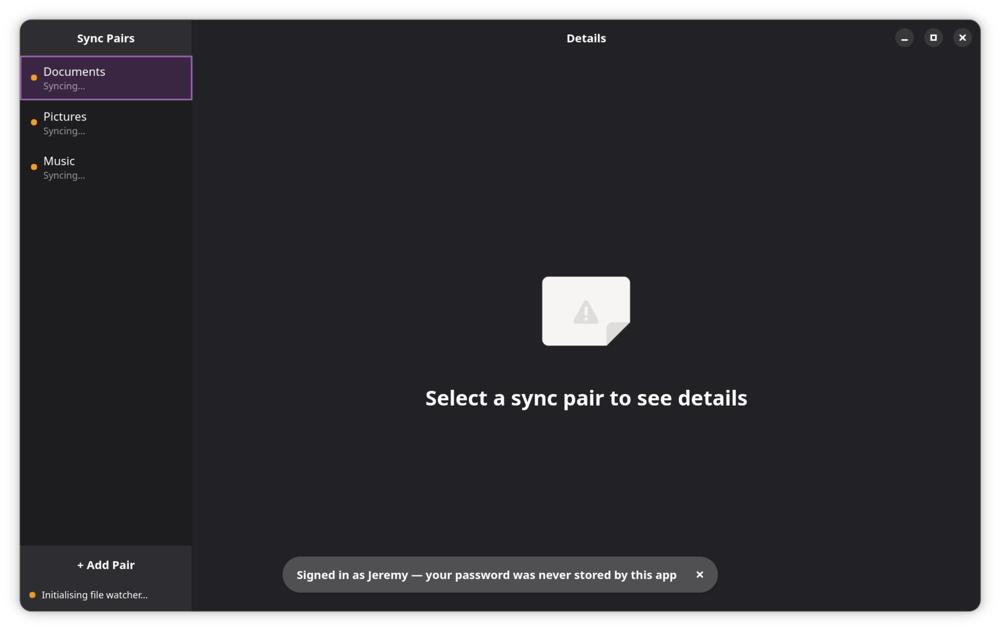

[](https://flathub.org/apps/io.github.ronki2304.ProtonDriveLinuxClient)
[](./LICENSE)

# ProtonDrive Linux Client

An unofficial open-source sync client for [ProtonDrive](https://proton.me/drive) on Linux — built as a native GTK4 desktop app using Proton's official SDK.

> **MVP release.** Core sync workflows are complete and functional. Flathub submission is in progress.

---

## What it does

- Authenticate with your Proton account via an embedded browser — no manual token management
- Set up one or more local folders to sync with ProtonDrive
- Two-way sync with conflict detection and automatic conflict copies
- Offline resilience — changes queue while offline and replay on reconnect
- Token expiry recovery — re-auth modal with queued change count, no data loss
- Error surfacing — disk full, permission denied, inotify limit exceeded, file locked
- Multi-pair management — add, remove, and manage multiple sync pairs independently



---

## Why this exists

No native ProtonDrive sync client exists for Linux. Third-party tools either scrape the web API or go unmaintained. This client uses `@protontech/drive-sdk` — Proton's own SDK, the same one their CLI will use — so it stays compatible as the API evolves.

The embedded WebKitGTK auth approach (localhost callback) was validated directly with the Proton SDK team and confirmed as the canonical pattern for desktop clients.

---

## Installation

Flatpak is the only supported installation method for the MVP.

```bash
flatpak install flathub io.github.ronki2304.ProtonDriveLinuxClient
```

> Flathub submission is pending. Until it lands, install from the bundle in [GitHub Releases](https://github.com/ronki2304/Linux_Proton_Drive/releases).

### Why `--filesystem=home`?

The Flatpak manifest requests broad filesystem access. This is a platform limitation: inotify (the Linux file-watching mechanism used for real-time sync) requires direct filesystem access — the XDG portal FUSE layer does not fire inotify events. This is a confirmed upstream limitation ([xdg-desktop-portal #567](https://github.com/flatpak/xdg-desktop-portal/issues/567)), not a design choice. A full plain-language justification is in [`flatpak/PERMISSIONS.md`](./flatpak/PERMISSIONS.md).

---

## Building from source

### Flatpak build (recommended — matches the release artifact)

Requirements: `flatpak`, `flatpak-builder`, GNOME Platform runtime 47.

```bash
git clone https://github.com/ronki2304/Linux_Proton_Drive
cd Linux_Proton_Drive

# Build and export to local repo
flatpak-builder --user --force-clean --disable-rofiles-fuse --repo=_repo builddir \
  flatpak/io.github.ronki2304.ProtonDriveLinuxClient.yml

# Register the local repo (first time only)
flatpak remote-add --user --no-gpg-verify local-repo _repo

# Install and run
flatpak install --user --reinstall -y local-repo io.github.ronki2304.ProtonDriveLinuxClient
flatpak run io.github.ronki2304.ProtonDriveLinuxClient
```

> `--disable-rofiles-fuse` is required in most Linux desktop environments — rootless containers and immutable distros typically lack FUSE mount permissions.

See [CONTRIBUTING.md](./CONTRIBUTING.md) for the full development setup, two-terminal launch procedure, and test commands.

---

## Debug logging

To follow engine activity in real time:

```bash
# Launch with debug logging enabled
PROTONDRIVE_DEBUG=1 flatpak run io.github.ronki2304.ProtonDriveLinuxClient

# In a second terminal
tail -f ~/.cache/protondrive/engine.log
```

Log file is capped at 5 MB and rotates to `engine.log.1`. Tokens are never written to the log.

---

## Roadmap

### MVP (complete — Epics 1–6)

| Area | Status |
|------|--------|
| Proton authentication (embedded WebKit + localhost callback) | ✅ |
| First sync pair setup wizard | ✅ |
| Two-way file sync engine | ✅ |
| Offline resilience & change queue | ✅ |
| Conflict detection & copy creation | ✅ |
| Conflict log & reveal in Files | ✅ |
| Token expiry recovery with queued-change count | ✅ |
| Actionable errors (disk full, permissions, inotify, file locked) | ✅ |
| Multi-pair management (add, remove, nesting/overlap validation) | ✅ |
| Missing local folder detection & recovery | ✅ |

### Flathub release (Epic 7 — in progress)

- Flatpak manifest with justified permissions
- AppStream metainfo & desktop file for GNOME Software / KDE Discover
- CI/CD pipelines (automated test + release builds)
- End-to-end manual validation on Fedora 43, Ubuntu 24/25, Bazzite, Arch

### Post-MVP (planned)

- **System-browser auth** — replace embedded WebKit with `Gio.AppInfo.launch_default_for_uri()` for the Proton login flow. Improves hardware-key 2FA, password manager autofill, and enables aarch64 support (current WebKitGTK JIT instability on ARM64). Same localhost callback pattern, no server-side changes.
- **ARM Linux support** — blocked on system-browser auth above.
- **Incremental reconciliation via SDK events** — on every startup the engine does a full remote tree walk for each pair (all `GET /folders/.../children` calls), which is slow for large folders and triggers Proton's public-key API rate limit (HTTP 429) on pre-2024 nodes. The SDK already ships a complete events subsystem: `DriveEventType.NodeCreated/NodeUpdated/NodeDeleted`, `VolumeEventManager.getEvents(eventId)` to fetch only changes since a saved event ID, `getLatestEventId()` to bookmark position after a full walk, `DriveEventType.TreeRefresh` as the server-side signal to fall back to a full walk (e.g. log pruned), and `DriveEventType.FastForward` when nothing changed. The pattern: after each reconcile persist `getLatestEventId()` to the state DB; on next startup call `getEvents(savedId)` and process only the delta nodes, falling back to a full walk only on `TreeRefresh`. This would make subsequent startups near-instant regardless of how long the app was closed. Needs confirmation from the Proton Drive SDK team that `VolumeEventManager` is a supported interface for third-party clients before building on it.
- **Selective sync** — choose which remote subfolders to sync per pair, rather than syncing the full remote folder.
- **Tray icon** — background sync with system tray status indicator, without keeping the main window open.
- **Per-pair parallel reconciliation** — currently the engine reconciles all pairs sequentially and only starts queue processing after all pairs have finished their remote tree walk. Each pair should start uploading/downloading as soon as its own reconciliation is done, independent of other pairs.

### Known MVP limitations

- No automated integration tests — Proton's auth requires CAPTCHA; integration tests need a manually captured token (`PROTONDRIVE_DEBUG=1` + `secret-tool`). Documented in CONTRIBUTING.md.
- inotify watch limit — the Linux default of 8192 watches may be insufficient for very large sync folders. Increase with `fs.inotify.max_user_watches=524288` in `/etc/sysctl.d/`. The app surfaces this as an actionable error.
- Same-day conflict copies — if the same file produces two conflicts on the same calendar day, the second copy overwrites the first. Rare in practice; scheduled for post-MVP hardening.
- Draft-only nodes — if a file upload is interrupted after the remote node is created but before the first revision is committed, the node has no active revision. The engine auto-recovers via a two-pass lookup (typed listing, then unfiltered children walk). Manual deletion from ProtonDrive Web is only needed in the rare case where the SDK does not expose the draft node in any listing.

---

## Troubleshooting

### Some folders show "Sync error" after a Proton password change

If you changed your Proton account password in the past, some folders may have their encryption keys sealed with the old key. The Linux client cannot decrypt them with your current credentials, so those folders show "Sync error" while others continue syncing normally.

**Fix:** Open [drive.proton.me](https://drive.proton.me) in your browser and navigate into the affected folder. Proton's web client automatically re-wraps the folder's key with your current account key. On the next sync cycle the error clears automatically — no restart needed.

---

## License

[](./LICENSE)

GPL-3.0-only — see [LICENSE](./LICENSE). Bundles @protontech/drive-sdk (GPL-3.0) and openpgp (LGPL-3.0+).
