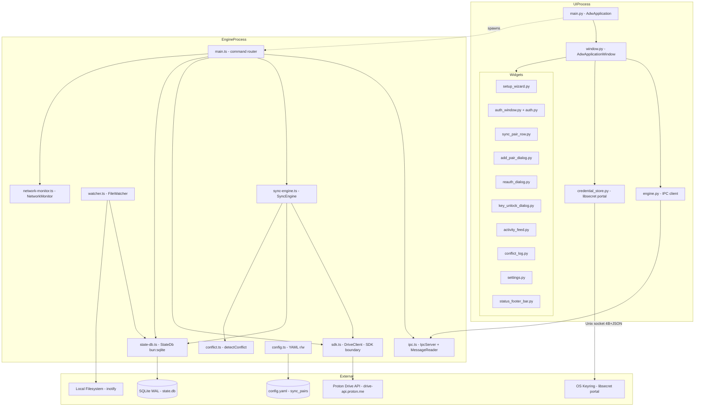

# Overall Architecture

Two-process desktop application. The UI process (Python/GTK4) spawns the Engine process (TypeScript/Bun) on startup and communicates with it exclusively over a Unix socket using the IPC protocol.

---

## Diagram

---

## Process Boundaries

| Concern | Process | Technology |
|---------|---------|-----------|
| UI, auth browser, widgets | UIProcess | Python 3.12, GTK4, Libadwaita, WebKitGTK 6.0 |
| Sync, file watching, network | EngineProcess | TypeScript, Bun 1.3.11 |
| Inter-process communication | Unix socket | 4-byte length-prefixed JSON (see `ipc-protocol.md`) |
| Credentials | OS keyring | libsecret via Flatpak Secret portal — never written to disk |
| Sync state | SQLite | WAL mode, `$XDG_DATA_HOME/protondrive/state.db` |
| Pair config | YAML | `$XDG_CONFIG_HOME/protondrive/config.yaml` |
| Remote storage | Proton Drive API | `@protontech/drive-sdk` — all imports confined to `sdk.ts` |

## Key Constraints

- **SDK boundary is enforced** — `@protontech/drive-sdk` may only be imported in `sdk.ts`; all other engine files import `DriveClient` from there.
- **UI never queries SQLite directly** — all state arrives via IPC push events.
- **Engine never reads libsecret** — token flows one way: libsecret → UI → `token_refresh` IPC command → engine.
- **Engine spawning differs by environment** — Flatpak: compiled self-contained binary at `/app/lib/protondrive-engine/dist/engine`; dev: `bun run engine/src/main.ts` via `GLib.find_program_in_path('bun')`.
