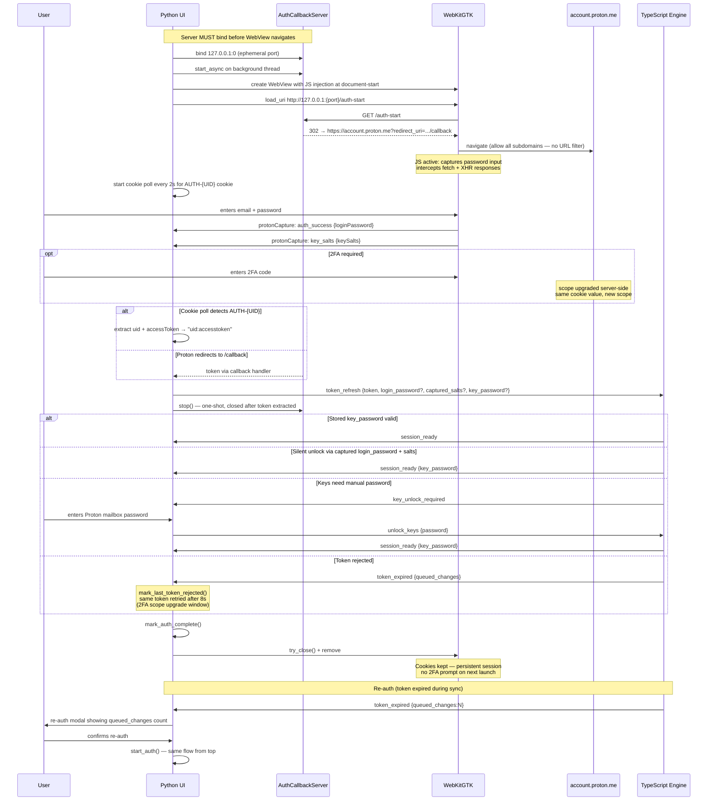

# Auth Flow

Authentication between the Python UI and Proton's identity service, with token handoff to the TypeScript Engine.

---

## Sequence

---

## Security Boundaries

- **Auth server binds to `127.0.0.1` only** — never `0.0.0.0`; not reachable from the network.
- **One-shot server** — closes immediately after the first token is extracted; leaving it running would be a security hole.
- **No URL filtering in WebView** — Proton redirects through multiple subdomains (`account.proton.me`, `mail.proton.me/api`, etc.); the security boundary is the localhost callback server, not URL filtering.
- **Token never logged** — `log_message` on the callback handler is suppressed to prevent the token leaking via the query string into logs.
- **Cookies kept on teardown** — persistent WebKit session so the user is not prompted for 2FA on every app launch.

## Key Data Captured by JS Injection

| Field | Source | Purpose |
|-------|--------|---------|
| `login_password` | `<input type="password">` events | Silent key derivation via bcrypt (avoids manual password dialog) |
| `captured_salts` | `GET /core/v4/keys/salts` response | Per-key bcrypt salts; only available with locked-scope token (pre-2FA window) |
| `auth_key_salt` | `POST /core/v4/auth` response | Legacy single-salt fallback for older accounts |
