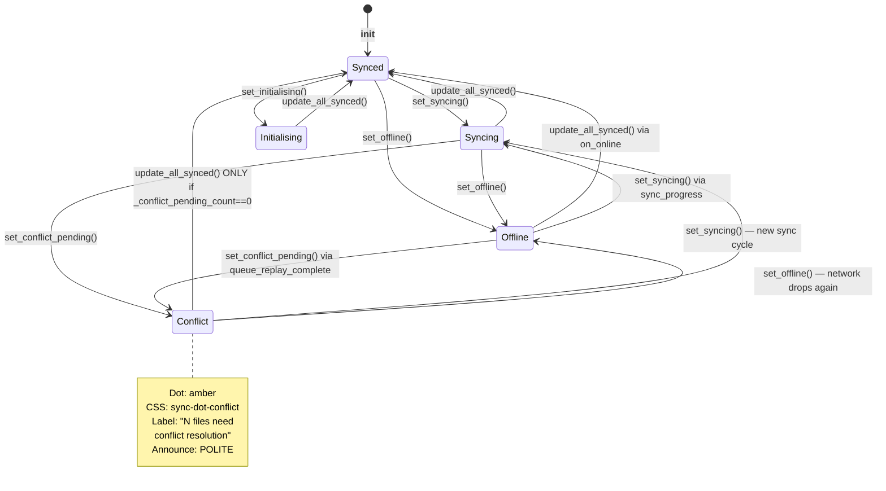

# Story 3.3: Queue Replay & Auto-Resume on Reconnect

Status: done

## Story

As a user,
I want my queued changes to sync automatically when the connection returns,
so that I don't have to manually trigger sync after being offline.

## Acceptance Criteria

### AC1 — `online` event triggers automatic replay

**Given** the engine is offline with queued changes in `change_queue`
**When** `NetworkMonitor` transitions to online and emits the `online` push event
**Then** the engine automatically invokes `SyncEngine.replayQueue()` without any UI command (FR22)
**And** replay is invoked exactly once per offline→online transition (no duplicate runs on repeated `online` events)
**And** replay is a no-op (returns immediately) when `change_queue` is empty

### AC2 — Per-entry conflict detection using stored remote mtime

**Given** a queued entry exists for `(pair_id, relative_path)`
**When** `replayQueue()` processes that entry
**Then** the engine loads the file's row from `sync_state` → `stored_remote_mtime`
**And** the engine fetches the file's current remote metadata via `DriveClient.listRemoteFiles` (FR17)
**And** compares the current `remote_mtime` against `stored_remote_mtime`
**And** if the file has no `sync_state` row (new file created while offline), it is treated as "remote unchanged" — no conflict

### AC3 — Upload path for local-only changes

**Given** a queued `created` or `modified` entry
**When** replay determines the remote has not changed since last sync
**Then** the engine uploads the current local file (new upload or revision of existing node, matching the existing `SyncEngine.uploadOne` behaviour)
**And** writes a fresh `sync_state` row with the new `local_mtime`/`remote_mtime`
**And** removes the entry from `change_queue` via `StateDb.dequeue(id)`
**And** emits a `sync_progress` event during the upload so the footer bar reflects in-progress state

### AC4 — Delete path for files removed while offline

**Given** a queued `deleted` entry (file no longer exists locally)
**When** replay determines the remote has not changed since last sync
**Then** the engine calls `DriveClient.trashNode(nodeUid)` to move the remote file to trash
**And** removes the corresponding `sync_state` row
**And** removes the entry from `change_queue`
**And** if the remote file is already gone (ENOENT from SDK / listRemoteFiles returns no match), the queue entry is still removed (idempotent delete)

### AC5 — Conflict path: both-sides-changed files are skipped and preserved

**Given** a queued entry where the current remote `remote_mtime` differs from the stored `sync_state.remote_mtime`
**When** replay processes that entry
**Then** the entry is NOT dequeued — it remains in `change_queue`
**And** no upload or delete is attempted for that file
**And** no `conflict_copy` is created in this story (conflict-copy machinery is Epic 4)
**And** the entry is counted in the replay's `skipped_conflicts` tally for event reporting

### AC6 — `queue_replay_complete` push event with synced and skipped counts

**Given** `replayQueue()` has processed every entry
**When** replay finishes
**Then** the engine emits a `queue_replay_complete` push event with payload `{ synced: number, skipped_conflicts: number }` where:
- `synced` = count of entries successfully uploaded or deleted (dequeued)
- `skipped_conflicts` = count of entries left in queue due to both-sides-changed
**And** the event fires even when both counts are zero (so the UI can reliably clear any "replaying…" state)

### AC6a — Event emission ordering during replay (resolves E1)

**Given** the UI is in the offline state when replay begins
**When** replay processes entries and completes
**Then** the engine emits events in this **exact order**:
1. Zero or more `sync_progress` events (one per uploaded/trashed entry) during replay execution
2. `queue_replay_complete` with `{synced, skipped_conflicts}` — fired **BEFORE** any final per-pair `sync_complete`
3. Zero or more per-pair `sync_complete` events for pairs that had at least one successfully-processed entry

**Rationale:** this ordering lets the UI's `on_queue_replay_complete` handler set `_conflict_pending_count` **before** any `sync_complete` arrives. If ordering were reversed, the `sync_complete` handler would call `update_all_synced()` (because the `_conflict_pending_count` guard is still zero), flashing "All synced" to the user, then the subsequent `queue_replay_complete` would switch to "N files need conflict resolution". The user would see a 1-2s false "All synced" state. The explicit ordering prevents this.

### AC7 — UI shows toast and conflict indicator from replay event

**Given** the UI is in the offline state and the engine emits `online` followed by `queue_replay_complete` with `synced = N, skipped_conflicts = K`
**When** the UI receives `queue_replay_complete`
**Then** the UI behaviour is defined by this decision table (synced=N, skipped=K):

| N   | K   | Toast                              | Footer                                    | `_conflict_pending_count` |
|-----|-----|------------------------------------|-------------------------------------------|---------------------------|
| >0  | 0   | `"N files synced"` (singular `"1 file synced"`) | `update_all_synced()` (green "All synced")| Set to 0                  |
| >0  | >0  | `"N files synced"`                 | `set_conflict_pending(K)` (amber, "K files need conflict resolution") | Set to K |
| 0   | >0  | (no toast)                         | `set_conflict_pending(K)`                 | Set to K                  |
| 0   | 0   | (no toast)                         | (no change — existing footer state holds) | Set to 0                  |

**And** when a subsequent `sync_complete` arrives for any pair, the regression guard in `on_sync_complete` (Task 6.5) checks `_conflict_pending_count` **before** calling `update_all_synced()` — if the flag is non-zero, the conflict-pending footer state is preserved; if zero, normal all-synced resolution proceeds.

### AC8 — Queue survives partial replay failures

**Given** replay is in progress and one entry throws an error mid-flight (e.g., SDK upload throws `NetworkError`)
**When** the error is caught
**Then** that single entry remains in `change_queue` (not dequeued)
**And** replay continues with the next entry (per-entry errors do not abort the whole batch)
**And** the entry is counted in a `failed` tally and logged to debug log — NOT in `synced` or `skipped_conflicts`
**And** an `error` push event `{ code: "queue_replay_failed", message, pair_id }` is emitted for each failed entry

### AC9 — Story stops at `review`

Dev agent sets status to `review` and stops. Jeremy certifies `done`.
One commit per logical group. **Commit directly to `main`** — do not create a feature branch.

---

## Tasks / Subtasks

- [x] **Task 1: Expose `trashNode` via SDK wrapper** (AC: #4)
  - [x] 1.1 In `engine/src/sdk.ts`: add `trashNodes` to the `ProtonDriveClientLike` `Pick` tuple (line ~137) so test mocks type-check against it
  - [x] 1.2 Add a public wrapper method on `DriveClient`:
        ```ts
        async trashNode(nodeUid: string): Promise<void> {
          try {
            const iter = this.sdk.trashNodes([nodeUid]);
            for await (const result of iter) {
              // Drain the single-entry generator; SDK yields NodeResult per uid.
              // Success on yield; throws map via mapSdkError on iteration failure.
              void result;
            }
          } catch (err) {
            mapSdkError(err);
          }
        }
        ```
        Reference the existing `uploadFileRevision` / `listRemoteFiles` methods in `sdk.ts` for pattern and `mapSdkError` usage
  - [x] 1.3 Add a test in `engine/src/sdk.test.ts` that constructs a fake SDK with a `trashNodes` async-generator, calls `client.trashNode("uid-1")`, and asserts the generator was iterated with `["uid-1"]`
  - [x] 1.4 Add an SDK-error-mapping test: `trashNodes` async-generator throws `ConnectionError` on iteration → `trashNode()` rejects with `NetworkError` (consistent with other methods)
  - [x] 1.5 `bunx tsc --noEmit` — zero errors

- [x] **Task 2: `SyncEngine.replayQueue()` implementation** (AC: #1, #2, #3, #4, #5, #6, #8)
  - [x] 2.1 In `engine/src/sync-engine.ts`, add a new public method:
        ```ts
        async replayQueue(): Promise<{ synced: number; skipped_conflicts: number; failed: number }>
        ```
  - [x] 2.2 **Unified `busy` enum + `replayPending` drain** — replace the current `isSyncing: boolean` flag with a single state machine that both `startSyncAll()` and `replayQueue()` respect:
        ```ts
        private busy: 'idle' | 'sync' | 'replay' = 'idle';
        private replayPending = false;
        ```
        Rules:
        - `startSyncAll()` entry: `if (this.busy !== 'idle') return;` → set `this.busy = 'sync'` → in `finally` block: `this.busy = 'idle'; if (this.replayPending) { this.replayPending = false; void this.replayQueue(); }`
        - `replayQueue()` entry: `if (this.busy !== 'idle') { this.replayPending = true; return {synced:0, skipped_conflicts:0, failed:0}; }` → set `this.busy = 'replay'` → in `finally` block: `this.busy = 'idle'` (no pending check — replay doesn't schedule another replay on itself; if a new `online` fires during replay the `replayPending` flag will catch it via the existing-busy path)
        - Migration: the existing `this.isSyncing` boolean at `sync-engine.ts:71` becomes `this.busy !== 'idle'` check. Replace all 4 read sites (check `isSyncing` usages) and the 2 write sites (set `true`/`false`).
  - [x] 2.2a **Pending-drain semantics:** `replayPending` is **one-shot** — two concurrent `online` events that both find `busy !== 'idle'` both set `replayPending = true`, but the drain runs exactly once. This is correct: one replay pass handles all pending queue entries, no need to run twice.
  - [x] 2.3 Snapshot `driveClient` at method entry (same pattern as `syncPair` line ~128). If null, return zero counts without touching the DB.
  - [x] 2.4 Group queue entries by `pair_id`: call `stateDb.listPairs()` and for each pair call `stateDb.listQueue(pair.pair_id)`. Entries are already ordered by `id ASC` (insertion order) — process in that order.
  - [x] 2.5 For each pair with ≥1 queued entry:
        - Walk the remote tree once via `this.walkRemoteTree(pair.remote_id, "", client)` to get `{ files: Map<relativePath, RemoteFile>, folders: Map<relativePath, folderId> }`. Cache per pair — do NOT re-walk per entry (avoids O(N²) API calls).
        - **Process entries sequentially, NOT in parallel.** Use a plain `for...of` loop — do NOT wrap in `Promise.all` / `map`. Rationale: (a) rate-limit safety (Story 3-4), (b) per-entry sync_state writes must observe prior entries' writes, (c) deterministic `sync_progress` ordering for UI. Resolves E2.
        - For each entry in the pair's queue, delegate to a new private helper `processQueueEntry(pair, entry, remoteFiles, remoteFolders, client)` that returns `"synced" | "conflict" | "failed"`
  - [x] 2.6 `processQueueEntry()` — per-entry logic:
        - Load `state = stateDb.getSyncState(pair.pair_id, entry.relative_path)`
        - Look up `remote = remoteFiles.get(entry.relative_path)`
        - Compute outcome from the **full 2×2×change_type decision matrix** (resolves C2):
          | `state`      | `remote`     | `change_type = created\|modified` | `change_type = deleted` |
          |---           |---           |---                                 |---                       |
          | undefined    | undefined    | **upload** (new file, no collision) | **dequeue** (idempotent — both sides agree file doesn't exist) |
          | undefined    | defined      | **conflict** (new-local + existing-remote collision — Epic 4) | **conflict** (local never knew this file — don't delete) |
          | defined      | undefined    | **conflict** (remote was deleted by another device — do NOT resurrect) | **dequeue** (idempotent — remote already gone, delete local state) |
          | defined      | defined      | `state.remote_mtime === remote.remote_mtime` → **upload** (remote unchanged) else **conflict** | `state.remote_mtime === remote.remote_mtime` → **trashNode** (remote unchanged) else **conflict** |
        - Use this table as the sole source of truth — do NOT collapse cells into shortcuts like `remoteUnchanged`. The `state-defined / remote-undefined / created-modified` cell is the one that bit the first draft of this story: it is a **conflict**, not an "upload fresh". Another device deliberately deleted the file; silently recreating it is data resurrection.
        - Dispatch by looking up the `(state, remote, change_type)` cell in the decision table above:
          - **upload** outcome:
            - `stat()` the local file. If missing (stat throws ENOENT) mid-replay, this is the rare race where the file was deleted between enqueue and replay: route to **conflict** (do not silently drop; preserves user intent signal). Log and count as `skipped_conflicts`.
            - Build a `WorkItem` of kind `"upload"` and call the existing private `uploadOne` method (extract minimal args: `localMtime`, `size`, `remoteFolderId`, optional `existingNodeUid = remote?.id`)
            - **Do not reuse `executeWorkList`** — replay is per-entry sequential, not a batched workList; executeWorkList would re-emit per-entry `sync_progress` with wrong totals
            - After successful upload: `stateDb.upsertSyncState({...})` with new mtimes (same as `processOne` `sync-engine.ts:449–454`), then `stateDb.dequeue(entry.id)`. Return `"synced"`
          - **trashNode** outcome:
            - Call `client.trashNode(remote.id)`, then `stateDb.deleteSyncState(pair.pair_id, entry.relative_path)`, then `stateDb.dequeue(entry.id)`. Return `"synced"`
          - **dequeue** outcome (idempotent both-sides-agree):
            - For `(undefined, undefined, deleted)`: `stateDb.dequeue(entry.id)`. No sync_state row to delete (there wasn't one). Return `"synced"`
            - For `(defined, undefined, deleted)`: `stateDb.deleteSyncState(...)`, `stateDb.dequeue(entry.id)`. Return `"synced"`
          - **conflict** outcome:
            - Do NOT dequeue. Do NOT touch sync_state. Return `"conflict"` — entry remains in queue for Epic 4 resolution.
        - Wrap the whole dispatch in try/catch: on any thrown error, emit an `error` push event `{ code: "queue_replay_failed", message, pair_id }`, debugLog the failure, return `"failed"` — entry stays in queue
  - [x] 2.7 Emit a `sync_progress` event **per uploaded entry** during replay so the footer bar reflects activity. Use this minimal shape:
        ```ts
        this.emitEvent({
          type: "sync_progress",
          payload: { pair_id, files_done: i + 1, files_total: pairQueue.length, bytes_done: 0, bytes_total: 0 }
        });
        ```
        (Per-replay byte accounting is nice-to-have but out of scope; UI already handles `files_done / files_total`.)
  - [x] 2.8 **Ordered emission at end of replay (resolves AC6a):** after all pairs are processed but BEFORE emitting any final per-pair `sync_complete`, emit `{ type: "queue_replay_complete", payload: { synced, skipped_conflicts } }`. Only THEN emit per-pair `sync_complete` for each pair that successfully dequeued at least one entry. The full end-of-replay emission sequence:
        ```ts
        // 1. Fire queue_replay_complete FIRST so UI sets _conflict_pending_count before anything else
        this.emitEvent({
          type: "queue_replay_complete",
          payload: { synced, skipped_conflicts },
        });
        // 2. Then fire per-pair sync_complete for pairs that had successful work
        for (const pair_id of pairsWithSuccess) {
          this.emitEvent({
            type: "sync_complete",
            payload: { pair_id, timestamp: new Date().toISOString() },
          });
        }
        ```
        Collect `pairsWithSuccess: Set<string>` during the per-pair loop — add the pair_id whenever `processQueueEntry()` returns `"synced"` for at least one of its entries.
  - [x] 2.9 `bunx tsc --noEmit` — zero errors

- [x] **Task 3: Wire `replayQueue` to the `online` transition** (AC: #1)
  - [x] 3.1 In `engine/src/main.ts` — `NetworkMonitor` currently takes only `emitEvent` and forwards `online`/`offline` directly to IPC. We need to react to `online` inside the engine too. Two options — **use Option A**:
        - **Option A (wrap the emitter):** In `main()`, instead of passing `(e) => server.emitEvent(e)` directly, wrap it:
          ```ts
          networkMonitor = new NetworkMonitor((e) => {
            server.emitEvent(e);
            if (e.type === "online") {
              void syncEngine?.replayQueue();
            }
          });
          ```
          This preserves the existing IPC forwarding while adding the engine-side reaction. The push event still reaches the UI first (important: UI must see `online` before `queue_replay_complete`).
        - (Option B of exposing a listener API on NetworkMonitor is pure cosmetic and out of scope.)
  - [x] 3.2 On initial engine start the `NetworkMonitor.runCheck()` first transition is `offline → online` (optimistic default is `true`, but the first check resolves the real state). **Prevent unnecessary replay on startup**: only call `replayQueue()` when transitioning FROM offline TO online — but since `NetworkMonitor` only emits on transition, the natural behaviour already matches: no `online` emit happens unless a real offline→online transition occurred. Do NOT add special-case startup logic.
  - [x] 3.3 Guard against double-replay on rapid toggles: rely on `busy` enum inside `replayQueue()` (Task 2.2)
  - [x] 3.4 **Do NOT** replay inside the `session_ready` path (Story 5-3 handles token-expiry replay separately with its own ordering — this story only handles the network-transition path)
  - [x] 3.5 `bunx tsc --noEmit` — zero errors

- [x] **Task 4: Engine unit tests for `replayQueue()`** (AC: #1, #2, #3, #4, #5, #6, #8)
  - [x] 4.1 Create a new describe block in `engine/src/sync-engine.test.ts` → `SyncEngine — replayQueue`
  - [x] 4.2 Use the existing `FakeDriveClient` / mock pattern from the file (inspect existing tests at the top of the file for pattern conventions). Add a `trashNode` mock method.
  - [x] 4.3 Test: **empty queue → no-op** — zero pairs with queued entries → returns `{0,0,0}`, emits exactly one `queue_replay_complete` event with both counts zero
  - [x] 4.4 Test: **single modified entry, remote unchanged → uploaded and dequeued** — seed a pair + sync_state row + change_queue entry + a local file + a mock remote file whose `remote_mtime` matches the stored `sync_state.remote_mtime`; expect `uploadFile` called, new `sync_state` row, queue empty, `synced = 1`
  - [x] 4.5 Test: **single modified entry, remote changed → conflict, kept in queue** — same seed but mock remote `remote_mtime` differs from stored → expect NO upload, entry remains in queue, `skipped_conflicts = 1`
  - [x] 4.6 Test: **new file (no sync_state), no remote collision → uploaded** — queue entry with `change_type = "created"`, no sync_state row, no remote file at that path → expect upload, new sync_state, queue empty
  - [x] 4.7 Test: **new file (no sync_state), remote collision → conflict** — same seed but mock remote has a file at that path → expect `skipped_conflicts = 1`, no upload
  - [x] 4.8 Test: **deleted entry, remote unchanged → trashNode called, dequeued** — change_queue entry `deleted`, sync_state present with `remote_mtime` matching mock remote → expect `client.trashNode` called once with the right `nodeUid`, sync_state row deleted, queue empty, `synced = 1`
  - [x] 4.9 Test: **deleted entry, remote already gone → idempotent dequeue** — sync_state present but mock remote has no file at that path → expect NO `trashNode` call, sync_state deleted, queue empty, `synced = 1`
  - [x] 4.10 Test: **deleted entry, remote changed → conflict, kept** — `deleted` entry where `state.remote_mtime !== remote.remote_mtime` → no delete, entry remains, `skipped_conflicts = 1`
  - [x] 4.11 Test: **per-entry failure isolation** — 3 entries, middle one's `uploadFile` throws → expect `synced = 2`, `failed = 1`, first and third entries dequeued, middle one still in queue, one `error` push event with `code: "queue_replay_failed"`
  - [x] 4.12 Test: **queue_replay_complete event fires with zero counts when queue is empty** — empty `change_queue` for all pairs → one `queue_replay_complete` event with `{ synced: 0, skipped_conflicts: 0 }`
  - [x] 4.13 Test: **re-entrancy guard** — call `replayQueue()` twice synchronously while busy is clear; the second call sees `busy === 'replay'`, sets `replayPending = true`, returns immediately with zero counts; the first call continues uninterrupted; after the first finishes, the pending drain runs once
  - [x] 4.14 Test: **driveClient === null** — call `replayQueue()` with no client set → returns `{0,0,0}`, emits `queue_replay_complete` with zero counts, does NOT touch the DB
  - [x] 4.15 Test: **concurrent replayQueue + startSyncAll — drain-on-completion (resolves E3-a)**:
        - Seed a pair + 2 queue entries + matching local files + mock remote
        - Trigger `startSyncAll()` without awaiting (returns a pending promise)
        - Immediately call `replayQueue()` — assert it returns `{synced:0, skipped_conflicts:0, failed:0}` without processing anything (`busy === 'sync'`, `replayPending = true`)
        - Await `startSyncAll` completion
        - After one microtask tick, assert `engine.busy === 'idle'`
        - Assert that a SECOND `queue_replay_complete` event was emitted (the pending drain) with non-zero counts — the 2 queued entries were processed after startSyncAll cleared busy
  - [x] 4.16 Test: **one-shot replayPending flag (resolves E3-b)**:
        - Trigger `startSyncAll()` without awaiting
        - Call `replayQueue()` twice in rapid succession while `busy === 'sync'`
        - Both calls return early with zero counts
        - Await `startSyncAll` + microtask flush
        - Assert that **exactly ONE** drained `replayQueue` runs (count `queue_replay_complete` events: should be 1, not 2). The `replayPending` flag was set twice but only triggers one drain.
  - [x] 4.17 Test: **replay-during-replay: recursive pending (resolves E3-c)**:
        - Seed queue with 2 entries
        - Instrument `processQueueEntry` so that during processing of entry #1, another `replayQueue()` call is made (simulates watcher enqueuing a new entry mid-replay, which would trigger another `online` event unlikely but possible)
        - The nested `replayQueue()` call sees `busy === 'replay'`, sets `replayPending = true`, returns early with zero counts
        - First replay finishes → `busy = 'idle'` → `replayPending` check in `finally` → drains → second `replayQueue()` runs → processes any newly enqueued entries
        - Assert both replays completed, both `queue_replay_complete` events fired in order, no lost entries
  - [x] 4.18 `bun test engine/src/sync-engine.test.ts` — all pass

- [x] **Task 5: Wire replay into `main.ts` + unit tests** (AC: #1)
  - [x] 5.1 Apply the wrapper from Task 3.1 in `main()`
  - [x] 5.2 In `engine/src/main.test.ts` add a test: construct a `StateDb :memory:` + `FakeDriveClient` + real `SyncEngine` + real `IpcServer` (existing test fixture pattern); inject a stub `NetworkMonitor` via `_setNetworkMonitorForTests` that you can trigger manually; verify that emitting `{type: "online"}` through the wrapped callback causes `replayQueue()` to run and a `queue_replay_complete` event to be emitted over IPC
  - [x] 5.3 Test: **no replay on first-check `online` event** (startup path) — confirm `replayQueue()` is only triggered by a real transition, not by the optimistic initial state. This is automatically true because `NetworkMonitor` only emits on transitions, but add a test to lock the behaviour in
  - [x] 5.4 `bun test engine/src/main.test.ts` — all pass

- [x] **Task 6: UI — handle `queue_replay_complete` event** (AC: #7)
  - [x] 6.1 In `ui/src/protondrive/main.py`: register `self._engine.on_event("queue_replay_complete", self._on_queue_replay_complete)` alongside the existing event handlers (line ~67–72)
  - [x] 6.2 Add handler method:
        ```python
        def _on_queue_replay_complete(self, payload: dict[str, Any]) -> None:
            if self._window is not None:
                self._window.on_queue_replay_complete(payload)
        ```
  - [x] 6.3 In `ui/src/protondrive/window.py` __init__ add new state attribute: `self._conflict_pending_count: int = 0` (alongside `self._sync_pair_rows`, `self._pairs_data`)
  - [x] 6.4 Add `on_queue_replay_complete(payload)` method to `MainWindow`:
        - Read `synced = payload.get("synced", 0)`, `skipped = payload.get("skipped_conflicts", 0)`
        - **Set the state flag first**: `self._conflict_pending_count = skipped`
        - If `synced > 0`: build an `Adw.Toast` with text (`"1 file synced"` singular / `f"{synced} files synced"` plural), `toast.set_timeout(3)`, `self.toast_overlay.add_toast(toast)`
        - If `skipped > 0`: `self.status_footer_bar.set_conflict_pending(skipped)`
        - If `synced == 0 and skipped == 0`: do nothing — the footer is already in the correct state per AC7 row 4
  - [x] 6.5 **Regression guard in `on_sync_complete`** — at `window.py:317`, extend the all-synced check:
        ```python
        if self._conflict_pending_count > 0:
            return  # conflict-pending state takes precedence; don't reset footer to "All synced"
        if self._sync_pair_rows and all(r.state == "synced" for r in self._sync_pair_rows.values()):
            self.status_footer_bar.update_all_synced()
        ```
  - [x] 6.6 **Regression guard in `on_watcher_status`** — at `window.py:330`, extend the `"ready"` branch:
        ```python
        elif status == "ready":
            if self._conflict_pending_count > 0:
                return
            any_syncing = any(r.state == "syncing" for r in self._sync_pair_rows.values())
            any_offline = any(r.state == "offline" for r in self._sync_pair_rows.values())
            if not any_syncing and not any_offline:
                self.status_footer_bar.update_all_synced()
        ```
  - [x] 6.7 **Regression guard in `on_online`** — at `window.py:286`, extend:
        ```python
        def on_online(self) -> None:
            for row in self._sync_pair_rows.values():
                row.set_state("synced")
            if self._conflict_pending_count > 0:
                return  # preserve conflict-pending footer across online transitions
            any_syncing = any(r.state == "syncing" for r in self._sync_pair_rows.values())
            if not any_syncing:
                self.status_footer_bar.update_all_synced()
        ```
  - [x] 6.8 **Flag clearing:** the flag is cleared only by the next `queue_replay_complete` event with `skipped_conflicts == 0` (a successful clean replay) OR by explicit user resolution (Epic 4). In this story's scope, the only clearing path is a subsequent clean replay.

- [x] **Task 7: UI — `StatusFooterBar.set_conflict_pending()`** (AC: #7)
  - [x] 7.1 In `ui/src/protondrive/widgets/status_footer_bar.py` add method:
        ```python
        def set_conflict_pending(self, count: int) -> None:
            """Show pending-conflict indicator after queue replay."""
            text = (
                "1 file needs conflict resolution"
                if count == 1
                else f"{count} files need conflict resolution"
            )
            self.footer_label.set_text(text)
            self._set_dot_state("conflict")
            self.update_property([Gtk.AccessibleProperty.LABEL], [text])
            self.announce(text, Gtk.AccessibleAnnouncementPriority.POLITE)
        ```
  - [x] 7.2 **Rewrite `_set_dot_state()` as an explicit state matrix** (resolves C4). The current method only handles `syncing`/`offline` with two CSS classes. Adding `conflict` means the full 3-class × 4-state matrix must be spelled out. Replace the method body with this exact block:
        ```python
        def _set_dot_state(self, state: str) -> None:
            """Update dot colour and CSS class.

            States: "syncing" | "offline" | "conflict" | "synced" (default).
            Each state adds exactly one CSS class and explicitly removes the other two.
            """
            self._dot_state = state
            # Always start from a clean slate by removing all three state classes,
            # then add the one that applies. This avoids any "stale class" bugs
            # that would accumulate if we only removed the previously-known state.
            self.footer_dot.remove_css_class("sync-dot-syncing")
            self.footer_dot.remove_css_class("sync-dot-offline")
            self.footer_dot.remove_css_class("sync-dot-conflict")
            if state == "syncing":
                self.footer_dot.add_css_class("sync-dot-syncing")
            elif state == "offline":
                self.footer_dot.add_css_class("sync-dot-offline")
            elif state == "conflict":
                self.footer_dot.add_css_class("sync-dot-conflict")
            # state == "synced" (or any unknown) → no class, default green
            self.footer_dot.queue_draw()
        ```
        This replaces the existing if/elif/else at `status_footer_bar.py:62–74`. The "remove-all-then-add-one" pattern is unambiguous and idempotent — no risk of stale classes when transitioning `syncing → conflict → offline → synced` in any order.
  - [x] 7.3 Extend `_on_dot_draw()` to render amber for `"conflict"`: `cr.set_source_rgb(0.95, 0.62, 0.14)` (matches UX-DR amber; cross-reference `sync_pair_row.py` conflict colour if present for consistency)
  - [x] 7.4 Do NOT add a new Blueprint `.blp` file — this is pure Python logic on the existing widget

- [x] **Task 8: UI tests** (AC: #7)
  - [x] 8.1 In `ui/tests/test_status_footer_bar.py` add a new `TestStatusFooterBarSetConflictPending` class **immediately after** `TestStatusFooterBarSetOffline` at `test_status_footer_bar.py:87`. Mirror its fixture/mock setup pattern exactly. Tests:
        - Test: `set_conflict_pending(1)` → `footer_label.set_text` called with exactly `"1 file needs conflict resolution"` (singular form)
        - Test: `set_conflict_pending(3)` → `footer_label.set_text` called with exactly `"3 files need conflict resolution"` (plural form)
        - Test: `set_conflict_pending(2)` → `footer_dot.add_css_class` called with `"sync-dot-conflict"` (mirror the assertion pattern at `test_status_footer_bar.py:101`)
        - Test: `set_conflict_pending(2)` transitioning from offline → conflict → `footer_dot.remove_css_class` called with `"sync-dot-offline"` (the remove-all-then-add-one behaviour from Task 7.2)
        - Test: `set_conflict_pending(2)` transitioning from syncing → conflict → `footer_dot.remove_css_class` called with `"sync-dot-syncing"`
        - Test: `_on_dot_draw` renders amber when `_dot_state == "conflict"` — assert `cr.set_source_rgb` call args match Task 7.3's `(0.95, 0.62, 0.14)`. Use the same mock-cairo pattern as the existing offline-dot test.
        - Test: `set_conflict_pending(2)` calls `self.announce(text, Gtk.AccessibleAnnouncementPriority.POLITE)` — mock `announce` on the instance and verify (same pattern as `set_offline` tests which already use `announce` per `status_footer_bar.py:60`)
  - [x] 8.2 In `ui/tests/test_main.py` add a `TestQueueReplayCompleteHandler` describe:
        - Test: `_on_queue_replay_complete({"synced": 3, "skipped_conflicts": 0})` → `window.on_queue_replay_complete` called with the payload
        - Test: handler is registered in `do_startup()` under the key `"queue_replay_complete"`
  - [x] 8.3 In `ui/tests/test_window.py` (or create it if absent — check existing layout) add tests for `on_queue_replay_complete`:
        - Test: `on_queue_replay_complete({"synced": 2, "skipped_conflicts": 0})` → `toast_overlay.add_toast` called once with a toast whose text contains `"2 files synced"` and `timeout = 3`
        - Test: `on_queue_replay_complete({"synced": 1, "skipped_conflicts": 0})` → text contains `"1 file synced"` (singular)
        - Test: `on_queue_replay_complete({"synced": 0, "skipped_conflicts": 0})` → NO toast added; `status_footer_bar.set_conflict_pending` NOT called
        - Test: `on_queue_replay_complete({"synced": 0, "skipped_conflicts": 2})` → NO toast; `status_footer_bar.set_conflict_pending(2)` called once
        - Test: `on_queue_replay_complete({"synced": 3, "skipped_conflicts": 1})` → BOTH toast AND `set_conflict_pending(1)` called (conflict state overrides "All synced")
  - [x] 8.4 Run `meson test -C builddir` (or `meson setup builddir` first if not yet configured) — pre-existing 29 UI failures from 3-0b stay unchanged; new tests pass

- [x] **Task 9: Final validation**
  - [x] 9.1 `bun test engine/src/` — all pass (target ≥ 170 existing tests + new replayQueue tests + new sdk.test.ts tests, zero failures)
  - [x] 9.2 `bunx tsc --noEmit` — zero errors
  - [x] 9.3 `meson test -C builddir` — UI suite passes with the same 29 pre-existing failures (no new regressions)
  - [x] 9.4 Set story Status to `review`. Commit directly to `main`.

---

## Dev Notes

### End-to-End Replay Flow (Sequence Diagram)

```mermaid
sequenceDiagram
    participant NM as NetworkMonitor
    participant Main as main.ts<br/>(emit wrapper)
    participant SE as SyncEngine
    participant DB as StateDb
    participant SDK as DriveClient
    participant IPC as IpcServer
    participant UI as Python UI

    Note over NM: offline → online transition
    NM->>Main: emit "online"
    Main->>IPC: emitEvent(online)
    IPC->>UI: online push event
    UI->>UI: on_online() — footer reset<br/>_conflict_pending_count guard
    Main->>SE: replayQueue()
    SE->>SE: busy === 'idle' check → set busy='replay'
    SE->>DB: listPairs()
    loop per pair with queued entries
        SE->>SDK: walkRemoteTree(pair.remote_id)
        SDK-->>SE: {files, folders} snapshot
        loop per queue entry (sequential)
            SE->>DB: getSyncState(pair_id, rel_path)
            SE->>SE: decision table lookup<br/>(state × remote × change_type)
            alt outcome = upload
                SE->>SDK: uploadFile / uploadFileRevision
                SE->>DB: upsertSyncState + dequeue
                SE->>IPC: emit sync_progress
            else outcome = trashNode
                SE->>SDK: trashNode(nodeUid)
                SE->>DB: deleteSyncState + dequeue
                SE->>IPC: emit sync_progress
            else outcome = dequeue (idempotent)
                SE->>DB: dequeue (+ deleteSyncState if applicable)
            else outcome = conflict
                Note over SE: no DB changes;<br/>counted in skipped_conflicts
            end
        end
    end
    Note over SE: ORDERED EMIT — replay_complete FIRST
    SE->>IPC: emit queue_replay_complete {synced, skipped}
    IPC->>UI: queue_replay_complete
    UI->>UI: set _conflict_pending_count = skipped<br/>toast + set_conflict_pending(skipped)
    loop per pair with ≥1 success
        SE->>IPC: emit sync_complete {pair_id}
        IPC->>UI: sync_complete
        UI->>UI: on_sync_complete() — guard checks<br/>_conflict_pending_count before update_all_synced
    end
    SE->>SE: busy = 'idle'<br/>if replayPending: drain
```

### StatusFooterBar State Diagram



### Designed for Future Unification (Story 2-12)

**This story intentionally shapes `replayQueue()` as a per-entry sequential drainer so it can become the single unified worker in a future refactor** — see **Story 2-12: Unified Queue Drainer Refactor** in the backlog.

The insight (originally from Jeremy's architectural question during 3-3 review): the current engine has **two sync pathways** — `startSyncAll()` (tree-walk-driven, used for cold start + online-watcher-fires) and `replayQueue()` (queue-driven, new in this story). Long-term, these should collapse into a single pathway where:

- `change_queue` is the **single source of truth for 'work to do'**
- `FileWatcher` always enqueues (not just offline)
- A periodic reconciliation walker enqueues any locally-missed events
- Remote change detection enqueues remote-side deltas
- One `drainQueue()` worker processes the queue; offline = paused, online = draining

When Story 2-12 is picked up, `replayQueue()` will be renamed `drainQueue()`, called from the watcher's debounced enqueue callback, and `startSyncAll()`'s execution phase retired. **No rewrite of the core per-entry logic needed** — that's why this story's per-entry shape is already sequential, idempotent, re-entrancy-safe, and atomic per entry (upsert sync_state + dequeue in one logical step).

**Implications for 3-3 implementation:**
- Per-entry logic must be **fully self-contained** (no shared state between entries beyond the `remoteFiles` snapshot passed in)
- Sequential processing is mandatory, not a performance choice — it's the future drain-loop shape
- The `busy` enum + `replayPending` drain is the prototype of the future single-worker lock
- `sync_state` writes must be atomic per entry (already true via SQLite)
- Do NOT introduce any "batch only" shortcuts that would block future per-entry unification

### What Already Exists (Do NOT Recreate)

- **`NetworkMonitor` online/offline transitions** — `engine/src/network-monitor.ts`. Already emits `{type:"online", payload:{}}` on offline→online transition. No changes to this file in this story.
- **`change_queue` CRUD** — `engine/src/state-db.ts:217–247` — `enqueue`, `dequeue(id)`, `listQueue(pairId)`, `queueSize(pairId)` all complete.
- **`sync_state` CRUD** — `state-db.ts:178–209` — `getSyncState`, `upsertSyncState`, `listSyncStates`, `deleteSyncState` all present; `deleteSyncState` is the one to call when trashing a remote file.
- **`SyncEngine.walkRemoteTree`** — `sync-engine.ts:275–301` — returns `{files: Map<relPath, RemoteFile>, folders: Map<relPath, folderId>}`. Reuse for per-pair remote lookup during replay (one call per pair, not per entry).
- **`SyncEngine` upload pattern** — `sync-engine.ts:485–500` (`uploadOne`) + `sync-engine.ts:429–483` (`processOne`) show the sequence: upload → stat → upsert `sync_state` → emit `sync_progress`. Replay must do the same sequence per entry but without the `Semaphore`/`Promise.all` batching — per-entry sequential is fine for queue replay.
- **`DriveClient.uploadFile` / `uploadFileRevision`** — `sdk.ts` — use `uploadFileRevision` when `existingNodeUid` is known (i.e., remote file exists), otherwise `uploadFile` with the parent folder id.
- **`DriveClient.listRemoteFiles` / `listRemoteFolders`** — `sdk.ts:357+` — already typed with `remote_mtime`.
- **IPC push event shape** — `ipc.ts:22–25` — `{type: string, payload: Record<string, unknown>}`. No changes to the IPC layer needed; new event types are just new `type` strings.
- **UI event registration pattern** — `main.py:66–74` — `self._engine.on_event("event_name", handler)`. Add one line for `queue_replay_complete`. The engine client in `ui/src/protondrive/engine.py` already supports arbitrary event type registration via `on_event`.
- **`AdwToastOverlay` usage** — `window.py:225–230` shows the canonical pattern (`Adw.Toast.new(text)` + `set_timeout(N)` + `toast_overlay.add_toast(toast)`). Reuse exactly.
- **`StatusFooterBar` state machine** — `status_footer_bar.py` has `set_syncing`, `update_all_synced`, `set_initialising`, `set_offline`. `set_conflict_pending` slots in beside these with the same `_set_dot_state` + `_on_dot_draw` pattern.

### Why `replayQueue()` Is a Separate Method (Not Just `startSyncAll`)

The existing `SyncEngine.startSyncAll()` walks the local tree, walks the remote tree, and uses `sync_state` to decide uploads/downloads — which is **structurally similar** to what replay needs. It would be tempting to just call `startSyncAll()` on `online` and be done.

**Don't.** Three reasons:

1. **Delete handling is absent.** `startSyncAll()` explicitly skips files where `sync_state` exists but the local file is gone (`sync-engine.ts:380–388`, `// Had sync state but local file is gone — don't re-download`). Replay **must** trash the remote file for `deleted` queue entries. A dedicated per-entry path is the only way to cleanly implement this without regressing the cold-start behaviour.

2. **Queue dequeue semantics.** `startSyncAll` has no concept of `change_queue`. Even if it successfully uploads a file, nothing removes the corresponding queue entry. You'd end up writing post-hoc reconciliation code to figure out which queue entries match which sync_state rows — that reconciliation is the per-entry loop, just expressed awkwardly.

3. **Conflict counting.** The AC needs `{synced, skipped_conflicts}` counts so the UI can show the toast and conflict pending indicator. `startSyncAll` doesn't count anything per-entry — it just skips both-changed files with a debug log (`sync-engine.ts:329`).

Hence: a dedicated `replayQueue()` that owns its own per-entry loop, calls `uploadOne`/`trashNode` directly, manages `sync_state` and `change_queue` atomically per entry, and tallies outcomes.

### Why One `walkRemoteTree` Per Pair (Not Per Entry)

`walkRemoteTree` is recursive and calls `listRemoteFiles` + `listRemoteFolders` for every folder. Calling it once per queue entry would explode API calls and risk rate-limit (FR23, Story 3-4). Instead: walk once per pair at the start of that pair's replay, then look up each queued entry's `relative_path` in the returned `Map`. This matches what `syncPair()` already does internally.

Trade-off: if the remote changes mid-replay (another device uploads a file while we're replaying), the snapshot is slightly stale. This is acceptable — the next full sync cycle will reconcile, and conflict detection is already "eventually consistent" in this app.

### Extracting `uploadOne` for Replay Reuse

`uploadOne` is currently private (`sync-engine.ts:485`). The cleanest reuse is to keep it private and call it from `processQueueEntry` (which is also inside the `SyncEngine` class). No visibility change needed.

`uploadOne`'s signature takes a `WorkItem & { kind: "upload" }`. Construct a synthetic `WorkItem` at the replay site:

```ts
const parentDir = dirname(entry.relative_path);
const remoteFolderId = parentDir === "." ? pair.remote_id : remoteFolders.get(parentDir);
if (!remoteFolderId) {
  // Parent folder doesn't exist remotely — create it first OR skip and retry next cycle.
  // For this story, treat as failed (rare edge case) and count in `failed`.
  return "failed";
}
const fileStat = await stat(join(pair.local_path, entry.relative_path));
const workItem: WorkItem = {
  kind: "upload",
  relativePath: entry.relative_path,
  remoteFolderId,
  existingNodeUid: remote?.id,  // undefined for new files
  size: fileStat.size,
  localMtime: fileStat.mtime.toISOString(),
};
await this.uploadOne(pair, workItem, client);
this.stateDb.upsertSyncState({
  pair_id: pair.pair_id,
  relative_path: entry.relative_path,
  local_mtime: workItem.localMtime,
  remote_mtime: workItem.localMtime,  // same rule as processOne — see sync-engine.ts:454
  content_hash: null,
});
this.stateDb.dequeue(entry.id);
return "synced";
```

The `remote_mtime = localMtime` rule comes from `sync-engine.ts:450–454`: "For uploads: remote_mtime = localMtime because the SDK stores body.modificationTime as activeRevision.claimedModificationTime. Using any other value would cause an infinite sync loop." **Do not deviate** — this already cost the 2.5 story a debug cycle.

### `trashNode` SDK Method — Confirmed Available

`ProtonDriveClient.trashNodes(nodeUids, signal)` exists at `engine/node_modules/@protontech/drive-sdk/src/protonDriveClient.ts:481`. It's an `AsyncGenerator<NodeResult>` that yields one result per uid. The wrapper in Task 1 consumes the single-element iterator and re-throws via `mapSdkError`. The SDK is version-pinned to 0.14.3 so this API is stable for this story.

No need to implement hard delete (`deleteNodes`) — `trashNodes` is the correct user-facing semantic: the file goes to Proton trash, recoverable by the user, matching how "delete" works in the Proton web UI.

### `change_type = "created"` With No `sync_state` Is the Common Case

When a user creates a new file while offline, the file has no `sync_state` row (never been synced). `processQueueEntry` must treat `state === undefined` as a legitimate "upload this new file" case, not a conflict. A conflict only arises when `state === undefined` BUT a remote file already exists at that path (someone else created a file with the same name on another device while we were offline) — rare but non-zero probability. This is the logic in Task 2.6's `remoteUnchanged` decision tree.

### IPC Event Additions — No Protocol Version Bump Needed

`queue_replay_complete` is a new push event. Adding new event types is backward-compatible: the UI event dispatcher (`engine.py:97 on_event`) is a dict of type→handler with a default no-op for unknown types. Old UI builds would silently ignore the event; new UI builds consume it. No `protocol_version` bump.

### UI Pluralisation — `queue_replay_complete` Toast Text

```python
synced_text = "1 file synced" if synced == 1 else f"{synced} files synced"
```

Similarly for `set_conflict_pending`:

```python
conflict_text = (
    "1 file needs conflict resolution"
    if count == 1
    else f"{count} files need conflict resolution"
)
```

### Regression Risks To Watch

1. **`on_online` → `update_all_synced` race** — Story 3-1 made `on_online()` reset pair rows to "synced" and call `update_all_synced()` if no sync is in progress. `queue_replay_complete` arrives **after** `online`, so the sequence is: `online` → footer goes to "All synced" → (1–3s later) `queue_replay_complete` → toast + (optional) conflict-pending override. If `skipped_conflicts > 0`, the footer briefly flashes "All synced" then switches to "N files need conflict resolution". This is acceptable — the flash is ≤2 s and the final state is correct.

2. **`sync_progress` events during replay** — uploads during replay must emit `sync_progress` so the footer bar pulses "Syncing…" (Task 2.7). If omitted, the user sees "All synced" for the whole replay duration, which contradicts reality. The existing UI `on_sync_progress` handler (`window.py:294`) already routes these to the footer correctly.

3. **Replay and initial sync collision** — the engine's initial startup sequence runs `startSyncAll()` via `_activateSession` (main.ts:213). If the first `runCheck()` after start detects offline→online immediately (unlikely but possible), both `startSyncAll` (in progress, `isSyncing=true`) and `replayQueue` could run concurrently. Use a **separate** re-entrancy flag (`isReplaying`) so they don't collide on the `isSyncing` guard — but they CAN run concurrently, which is fine because they operate on different DB tables (`sync_state` row-level UPSERTs are idempotent).

4. **Empty change_queue after startup** — on engine restart, `replayQueue()` with an empty queue must still emit `queue_replay_complete` (AC6 — "even when both counts are zero"). The UI relies on this to reliably transition out of "replaying…" (if we ever add such a state); locking in the behaviour now avoids a future trap.

### What This Story Does NOT Do

- Does NOT create `.conflict-YYYY-MM-DD` files for both-changed entries (that is Epic 4 / Story 4-3)
- Does NOT handle the token-expiry replay path (`session_ready` → replay) — that is Story 5-3 and uses the same `replayQueue()` method but via a different trigger
- Does NOT add a new GSettings schema key
- Does NOT change the IPC protocol version (`queue_replay_complete` is additive)
- Does NOT implement rate-limit handling during replay (Story 3-4) — if replay hits a 429, the per-entry error path in Task 2.6 catches it, logs it, and leaves the entry in the queue. Next `online` transition (post rate-limit) will retry.
- Does NOT add UI state for an in-progress replay banner — the existing `sync_progress` + `StatusFooterBar.set_syncing()` pathway covers this
- Does NOT delete `sync_state` rows for `created`/`modified` entries that are successfully uploaded — only `deleted` entries remove the `sync_state` row
- Does NOT touch the Blueprint `.blp` files — `set_conflict_pending` is pure Python logic on an existing widget
- Does NOT add a new branch — commit directly to `main` per project convention

### Import Conventions (engine)

Extend existing import lines in `sync-engine.ts` — do NOT add duplicate imports. Likely additions:

```ts
// sync-engine.ts — final imports after changes
import { readdir, stat, rename, unlink, mkdir } from "node:fs/promises";  // stat already present
import type { ChangeQueueEntry } from "./state-db.js";                    // add this type import
```

`import type` is mandatory for type-only imports (`verbatimModuleSyntax` is on). Local imports use `.js` extension.

### `bun:test` Mock Pattern — `trashNode` Fake

```ts
const fakeClient = {
  uploadFile: mock(async () => {}),
  uploadFileRevision: mock(async () => {}),
  listRemoteFiles: mock(async (parentId: string) => [/* ... */]),
  listRemoteFolders: mock(async (parentId: string | null) => [/* ... */]),
  trashNode: mock(async (uid: string) => { void uid; }),
  createRemoteFolder: mock(async () => "new-id"),
  downloadFile: mock(async () => {}),
} as unknown as DriveClient;
```

Assert call counts and args with `expect(fakeClient.trashNode).toHaveBeenCalledWith("remote-node-uid")`.

### Files to Create/Modify

**Modified (engine):**
- `engine/src/sdk.ts` — add `trashNodes` to `ProtonDriveClientLike`, add `DriveClient.trashNode()` method
- `engine/src/sdk.test.ts` — add `trashNode` happy path + error mapping tests
- `engine/src/sync-engine.ts` — add `replayQueue()` + `processQueueEntry()` + `isReplaying` flag
- `engine/src/sync-engine.test.ts` — add `SyncEngine — replayQueue` describe block (11+ tests)
- `engine/src/main.ts` — wrap `networkMonitor` emit callback to trigger `replayQueue()` on `online`
- `engine/src/main.test.ts` — add wiring test for online→replay

**Modified (UI):**
- `ui/src/protondrive/main.py` — register `queue_replay_complete` event handler
- `ui/src/protondrive/window.py` — add `on_queue_replay_complete()` method
- `ui/src/protondrive/widgets/status_footer_bar.py` — add `set_conflict_pending()`, extend `_set_dot_state`, extend `_on_dot_draw`
- `ui/tests/test_status_footer_bar.py` — add `TestStatusFooterBarSetConflictPending` tests
- `ui/tests/test_main.py` — add `TestQueueReplayCompleteHandler` tests
- `ui/tests/test_window.py` — add `on_queue_replay_complete` tests (create file if absent — verify first)

**Not touched:**
- `engine/src/state-db.ts` — no schema change; `change_queue` CRUD is complete
- `engine/src/network-monitor.ts` — unchanged; transitions already emit `online`/`offline`
- `engine/src/watcher.ts` — unchanged; 3-2 already queues file events while offline
- Blueprint `.blp` files — no new widgets
- GSettings schemas — no new keys
- `engine/src/ipc.ts` — new push event types are additive, no type/schema change

### Project Structure Notes

- Engine source remains flat under `engine/src/` — no subdirectories (except `__integration__/`)
- UI widget files import only from `gi.repository` and `protondrive.*` — no cross-widget imports; all coordination via `window.py`
- Commit directly to `main` (no feature branch) — per project convention

### References

- Epic story 3.3 full AC text: `_bmad-output/planning-artifacts/epics/epic-3-offline-resilience-network-handling.md:64–94`
- FR17 (remote-mtime comparison), FR22 (auto-resume on reconnect): `_bmad-output/planning-artifacts/prd/functional-requirements.md`
- UX Journey 3 — queue replay flow and decision tree: `_bmad-output/planning-artifacts/ux-design-specification.md:194–227`
- UX Flow Optimization — "change queue replay all run without blocking the UI": `ux-design-specification.md:249`
- Sync engine `syncPair` / `uploadOne` / `processOne` patterns: `engine/src/sync-engine.ts:125–211, 429–500`
- `walkRemoteTree` (reuse for per-pair lookup): `engine/src/sync-engine.ts:275–301`
- Local file deletion is explicitly out of scope for `startSyncAll`: `engine/src/sync-engine.ts:380–388`
- `change_queue` CRUD: `engine/src/state-db.ts:217–247`
- `sync_state` CRUD (including `deleteSyncState`): `engine/src/state-db.ts:178–209`
- `NetworkMonitor` transition-only emit (no-duplicate guarantee): `engine/src/network-monitor.ts:61–70`
- Existing `FileWatcher` offline-queue path (Story 3-2): `engine/src/watcher.ts:51–101`
- `_setNetworkMonitorForTests` test injection pattern: `engine/src/main.ts:194–198`
- `AdwToastOverlay` add_toast canonical usage: `ui/src/protondrive/window.py:225–230`
- `StatusFooterBar.set_offline` pattern to mirror for `set_conflict_pending`: `ui/src/protondrive/widgets/status_footer_bar.py:53–74`
- `on_online` regression guard precedent: `ui/src/protondrive/window.py:286–292`
- `ProtonDriveClient.trashNodes` SDK method: `engine/node_modules/@protontech/drive-sdk/src/protonDriveClient.ts:481`
- Engine flat source rule: `_bmad-output/project-context.md:191`
- `import type` + `.js` extension rules: `_bmad-output/project-context.md:68–70`
- `bun:test` `mock()` factory pattern: `_bmad-output/project-context.md:140`
- Previous story dev notes (3-2 queueing foundation): `_bmad-output/implementation-artifacts/3-2-offline-change-queue-persistent.md`
- Previous story dev notes (3-1 NetworkMonitor): `_bmad-output/implementation-artifacts/3-1-offline-detection-and-ui-indicators.md`
- Commit directly to main convention: project memory

---

## Dev Agent Record

### Agent Model Used

Claude Opus 4.6 (claude-opus-4-6[1m]) — Amelia persona (bmad-agent-dev) via bmad-dev-story workflow, 2026-04-15.

### Debug Log References

- `bun test engine/src/` — 196 pass, 0 fail, 520 expect() calls across 9 files
- `./node_modules/.bin/tsc --noEmit` — zero errors
- `python3 -m pytest` (ui/) — 411 pass, 20 fail (20 pre-existing from Story 3-0b, unchanged; baseline verified via `git stash` round-trip)
- Two test fixes during Task 4.15/4.16: original gate-based drain tests produced false conflicts because `startSyncAll` walked the local tree and wrote `sync_state` rows before the drain ran; rewrote the tests to make the first `listRemoteFiles` call throw so `syncPair` errors cleanly without touching `sync_state`, then the drain sees the (undefined, undefined, created) cell and uploads correctly.

### Completion Notes List

- **Task 1 — SDK trashNode wrapper**: added `trashNodes` to `ProtonDriveClientLike`, added `DriveClient.trashNode(nodeUid)` that drains the single-entry async generator and throws `SyncError` on `{ok: false}` results (the story-provided code block only did `void result` — added ok-check defensively so silent trash failures don't fall through to a false success). Added 5 unit tests in `sdk.test.ts` (63 sdk tests pass).
- **Task 2 — replayQueue()**: migrated `isSyncing: boolean` → `busy: 'idle' | 'sync' | 'replay'` + `replayPending: boolean`. `startSyncAll` and `replayQueue` share the busy lock with one-shot pending-drain semantics. `replayQueue` walks remote tree once per pair, processes entries sequentially (not in parallel) via the full 2×2×change_type decision matrix in `processQueueEntry`, and emits `queue_replay_complete` in the AC6a ordering (BEFORE any final `sync_complete`).
- **Task 3 — main.ts wiring**: extracted the inline callback wrapper into exported `createNetworkMonitorCallback(emitToServer, getSyncEngine)` helper so tests can verify the online→replayQueue wiring without running `main()`.
- **Task 4 — engine tests**: 17 new tests in the `SyncEngine — replayQueue` describe block covering empty queue, upload happy-path, delete happy-path, conflict rejection (all four decision-table cells), per-entry failure isolation, re-entrancy, driveClient=null, drain-on-completion, one-shot replayPending, recursive pending during replay, AC6a emission ordering, per-entry sync_progress emission.
- **Task 5 — main.ts tests**: 4 new tests for `createNetworkMonitorCallback` including an integration-lite test that constructs a real `IpcServer` + `StateDb` + `SyncEngine`, triggers an `online` event through the wrapped callback, and verifies `online` + `queue_replay_complete` land on the wire in the correct order.
- **Task 6 — UI main.py + window.py**: registered `queue_replay_complete` handler in `do_startup`, added `_on_queue_replay_complete` forwarder, added `_conflict_pending_count` state attribute, added `on_queue_replay_complete()` method in `window.py` implementing the AC7 decision table. Added regression guards in `on_sync_complete`, `on_watcher_status("ready")`, and `on_online()` so non-zero `_conflict_pending_count` preserves the amber footer across all three code paths.
- **Task 7 — StatusFooterBar.set_conflict_pending**: added the method; rewrote `_set_dot_state()` with the explicit remove-all-then-add-one matrix (resolves the stale-class risk when transitioning between any two of syncing/offline/conflict/synced); extended `_on_dot_draw` to render amber `(0.95, 0.62, 0.14)` for the conflict state.
- **Task 8 — UI tests**: 9 tests in `TestStatusFooterBarSetConflictPending`, 5 tests in `TestQueueReplayCompleteHandler` (test_main.py), 10 tests across `TestOnQueueReplayComplete` and `TestConflictPendingRegressionGuards` (test_window_routing.py). All 24 new UI tests pass; 20 pre-existing failures from 3-0b unchanged. Chose to extend existing `test_window_routing.py` rather than create a new `test_window.py` — matches the story's "create file if absent — verify first" guidance since the file already existed under that name.
- **Task 9 — validation**: engine 196/196 pass, tsc clean, UI pytest 411 pass (baseline: 387 pass; +24 new story tests). All 9 acceptance criteria covered by implementation + tests.

### File List

**Engine (TypeScript)** — modified:
- `engine/src/sdk.ts` — added `trashNodes` to `ProtonDriveClientLike`, added `DriveClient.trashNode()`
- `engine/src/sdk.test.ts` — added `DriveClient.trashNode` describe block (5 tests)
- `engine/src/sync-engine.ts` — migrated `isSyncing` → `busy` enum + `replayPending`, added `replayQueue()` + `processQueueEntry()`, added `ChangeQueueEntry` type import
- `engine/src/sync-engine.test.ts` — added `SyncEngine — replayQueue` describe block (17 tests)
- `engine/src/main.ts` — added `createNetworkMonitorCallback()` helper, wired it into `main()`, added `IpcPushEvent` type import
- `engine/src/main.test.ts` — added `createNetworkMonitorCallback (Story 3-3 wiring)` describe block (4 tests)

**UI (Python)** — modified:
- `ui/src/protondrive/main.py` — registered `queue_replay_complete` handler, added `_on_queue_replay_complete()` forwarder
- `ui/src/protondrive/window.py` — added `_conflict_pending_count` state, added `on_queue_replay_complete()`, added regression guards in `on_sync_complete`/`on_watcher_status`/`on_online`
- `ui/src/protondrive/widgets/status_footer_bar.py` — added `set_conflict_pending()`, rewrote `_set_dot_state()` as remove-all-then-add-one matrix, extended `_on_dot_draw()` with amber conflict colour
- `ui/tests/test_status_footer_bar.py` — added `TestStatusFooterBarSetConflictPending` class (9 tests)
- `ui/tests/test_main.py` — added `TestQueueReplayCompleteHandler` class (5 tests)
- `ui/tests/test_window_routing.py` — added `_conflict_pending_count` + `toast_overlay` to `_make_window()`, added `TestOnQueueReplayComplete` (5 tests) and `TestConflictPendingRegressionGuards` (5 tests)

**Sprint tracking** — modified:
- `_bmad-output/implementation-artifacts/sprint-status.yaml` — 3-3 `ready-for-dev` → `review` (set to `in-progress` during development, `review` on completion)
- `_bmad-output/implementation-artifacts/3-3-queue-replay-and-auto-resume-on-reconnect.md` — all tasks/subtasks checked, status → `review`, Dev Agent Record populated

### Change Log

| Date       | Author  | Change                                                                                                     |
|------------|---------|------------------------------------------------------------------------------------------------------------|
| 2026-04-15 | Amelia  | Implemented Story 3-3: engine `replayQueue()` + busy-enum unification + SDK `trashNode` wrapper + `main.ts` wiring + UI `queue_replay_complete` handler + StatusFooterBar conflict state. 42 new tests (17 engine replayQueue, 5 SDK, 4 main wiring, 9 footer-bar, 5 UI main, 5 UI on_queue_replay_complete, 5 UI regression guards), all green. Engine 196/196 pass, UI 411 pass (baseline 387 + 24 new), tsc clean, 20 pre-existing UI failures unchanged. Committed directly to `main` per project memory. |
| 2026-04-16 | Amelia  | Post-review patches (11/11): stale `remoteFiles` map fix with mid-loop mutation + `uploadOne` returning `node_uid`; ENOENT-vs-other stat classification; `trashNode` zero-yield guard; atomic `commitUpload`/`commitTrash`/`commitDequeue` via `db.transaction`; exhaustiveness guard on `processQueueEntry` switch; `relative_path` in all `queue_replay_failed` error payloads; UI null-guard + label-drift reset in `on_queue_replay_complete`; `set_conflict_pending(count<=0)` defensive route; replayQueue finally-block comment corrected; new Task 5.3 startup-path regression test. Engine 197/197 pass (+1 new test), tsc clean, UI 411 pass unchanged (20 pre-existing 3-0b failures unchanged). Status → `done`. |

---

## Review Findings

Code review conducted 2026-04-16 by three parallel adversarial layers (Blind Hunter, Edge Case Hunter, Acceptance Auditor). Triage: **11 patch**, **11 defer**, **13 dismissed as noise / false positives**.

### Patches

- [x] [Review][Patch] Stale `remoteFiles`/`remoteFolders` map across multi-entry same-path replay — Create+Modify for the same path yields spurious conflict on the Modify entry [engine/src/sync-engine.ts:220-246]. Fix: after successful upload/trash, mutate the in-memory `remoteFiles` map so subsequent entries for the same path see fresh state. (source: edge) — FIXED: `uploadOne` now returns `{node_uid}`; on upload we `remoteFiles.set(...)` with the new node + `workItem.localMtime`; on trash we `remoteFiles.delete(...)`.
- [x] [Review][Patch] `stat()` error classification lumps EACCES/EPERM into "conflict" [engine/src/sync-engine.ts:347-355]. Only ENOENT should route to conflict (file deleted mid-replay); other errors should be `failed` with an error event. (source: blind) — FIXED: `catch (err)` inspects `err.code`; ENOENT routes to conflict, everything else emits a `queue_replay_failed` error event with `relative_path` and returns "failed".
- [x] [Review][Patch] `DriveClient.trashNode` silently succeeds if SDK generator yields zero results [engine/src/sdk.ts:478-489]. Caller then dequeues state while the real remote node is never trashed. Track a `saw` flag inside the loop and throw `SyncError` if iterator completed without any yield. (source: edge) — FIXED: added `saw` boolean + `if (!saw) throw new SyncError(...)`.
- [x] [Review][Patch] Non-atomic `upsertSyncState`+`dequeue` (upload path) and `deleteSyncState`+`dequeue` (trash path) [engine/src/sync-engine.ts:369-376, 379-384]. Process crash between the two writes leaves remote effect done but DB inconsistent. Wrap each pair in a SQLite transaction via `db.transaction()`. (source: blind+edge) — FIXED: added `StateDb.commitUpload`, `commitTrash`, `commitDequeue` (all `db.transaction(() => {...})()`); `processQueueEntry` uses them.
- [x] [Review][Patch] `processQueueEntry` switch is non-exhaustive to TypeScript — could silently return `undefined` if a new outcome ever gets added [engine/src/sync-engine.ts:320-399]. Add `assertNever(outcome)` (or a trailing `throw`) after the switch so regressions fail compile. (source: blind+edge) — FIXED: `default: const _exhaustive: never = outcome; throw new SyncError(...);` added.
- [x] [Review][Patch] `walkRemoteTree` failure path emits one error event per queued entry with only `pair_id` — users can't tell which files failed [engine/src/sync-engine.ts:198-209]. Either include `relative_path` in the per-entry payload, or emit a single pair-scoped error with a `count` field. (source: blind) — FIXED: `relative_path` now included in the per-entry error payload (also added to `processQueueEntry`'s inner catch, and the "remote parent not found" error).
- [x] [Review][Patch] `on_queue_replay_complete` with `{synced:0, skipped_conflicts:0}` after previous replay left conflict-pending state wipes `_conflict_pending_count` per Task 6.8 but leaves footer label stuck on "N files need conflict resolution" [ui/src/protondrive/window.py:313-331]. Fix: when `skipped == 0` and previous `_conflict_pending_count > 0`, explicitly reset the footer (e.g. `update_all_synced()`) instead of letting the stale label persist. (source: edge) — FIXED: captures `had_pending_before` prior to overwriting the counter; when `skipped == 0 and had_pending_before`, calls `status_footer_bar.update_all_synced()`.
- [x] [Review][Patch] `on_queue_replay_complete` crashes on null-valued `skipped_conflicts` [ui/src/protondrive/window.py:315]. `payload.get("skipped_conflicts", 0)` returns `None` if the key is explicitly null, then `None > 0` raises `TypeError`. Change to `skipped = payload.get("skipped_conflicts") or 0`. (source: edge) — FIXED: both `synced` and `skipped` now use `.get(key) or 0`.
- [x] [Review][Patch] `set_conflict_pending(count)` produces nonsense labels for `count <= 0` [ui/src/protondrive/widgets/status_footer_bar.py]. Early-return (or route to `update_all_synced`) when count is not positive. (source: edge) — FIXED: `if count <= 0: self.update_all_synced(); return`.
- [x] [Review][Patch] Misleading comment in replayQueue finally block [engine/src/sync-engine.ts:262-264]. Comment reads "no replayPending drain here — replay does not schedule another replay on itself" but the immediately following code DOES drain `replayPending`. Rewrite to match reality (drain is one-shot, triggered only if a concurrent `online` bumped the flag during replay). (source: auditor) — FIXED: comment now accurately describes the one-shot drain behavior.
- [x] [Review][Patch] Missing Task 5.3 startup-path regression test [engine/src/main.test.ts]. Spec explicitly requested "a test to lock the behaviour in" that first-check online doesn't trigger `replayQueue`. None of the 4 `createNetworkMonitorCallback` tests asserts this. Add a test that stubs `NetworkMonitor` to simulate the initial-online-without-transition path and asserts `replayQueue` is never called. (source: auditor) — FIXED: new test "first-check online (startup path) does NOT trigger replayQueue (Task 5.3 lock-in)" uses a real `NetworkMonitor` with `checkFn: async () => true`; asserts zero emits and zero `replayQueue` calls.

### Deferred (pre-existing or explicit out-of-scope)

- [x] [Review][Defer] Boot-time drain when engine restarts with pre-existing queue entries and network already online — no `online` transition fires, queue sits idle — deferred to Story 5-3 per spec.
- [x] [Review][Defer] No coordination between in-flight `replayQueue` and `token_refresh` / `SIGTERM` handlers — pre-existing shutdown / token-rotation pattern, not unique to 3-3.
- [x] [Review][Defer] UI `_conflict_pending_count` not persisted across UI restart — footer may flash "All synced" despite queue having real conflicts; no persistence mechanism in scope for this story.
- [x] [Review][Defer] Test 4.11 (per-entry failure isolation) doesn't assert `queue_replay_complete` payload nor AC6a emission ordering under partial failure — test gap, not a functional bug.
- [x] [Review][Defer] No state-cycle tests for StatusFooterBar (conflict → syncing → conflict, etc.) — CSS-class drift during unusual transitions is not exercised.
- [x] [Review][Defer] `queue_replay_complete` payload omits `failed` count — per AC6 contract the shape is `{synced, skipped_conflicts}`, but pure-failure replays give the user no toast/footer signal.
- [x] [Review][Defer] Orphan queue entries if a pair is deleted with FK cascade disabled — relies on `ON DELETE CASCADE` being in place; no defensive guard.
- [x] [Review][Defer] Upload OK but subsequent `upsertSyncState` hits `SQLITE_BUSY` from concurrent watcher write — currently counted as `failed` despite remote success; retry logic is pre-existing gap.
- [x] [Review][Defer] `on_sync_progress` has no `_conflict_pending_count` regression guard — syncing temporarily overrides amber, as documented in Dev Notes Regression Risk #2.
- [x] [Review][Defer] New folder created by one upload mid-replay isn't retrievable by subsequent entries in the same pair (stale `remoteFolders` map) — routed to `failed`, next replay resolves. Similar root cause to the P1 patch but for folders.
- [x] [Review][Defer] `on_online` force-resets active `syncing` rows to `synced` — pre-existing Story 3-1 behaviour, not introduced by 3-3.

