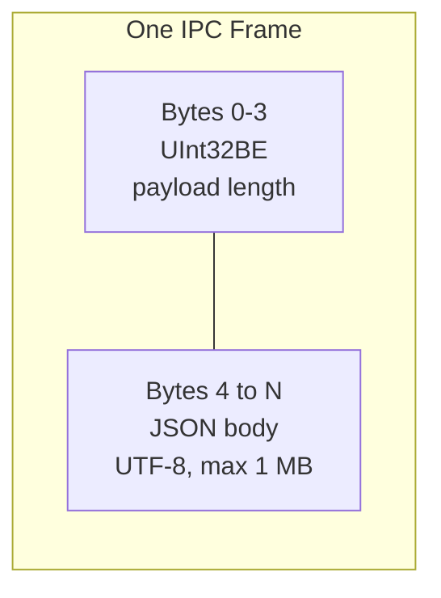
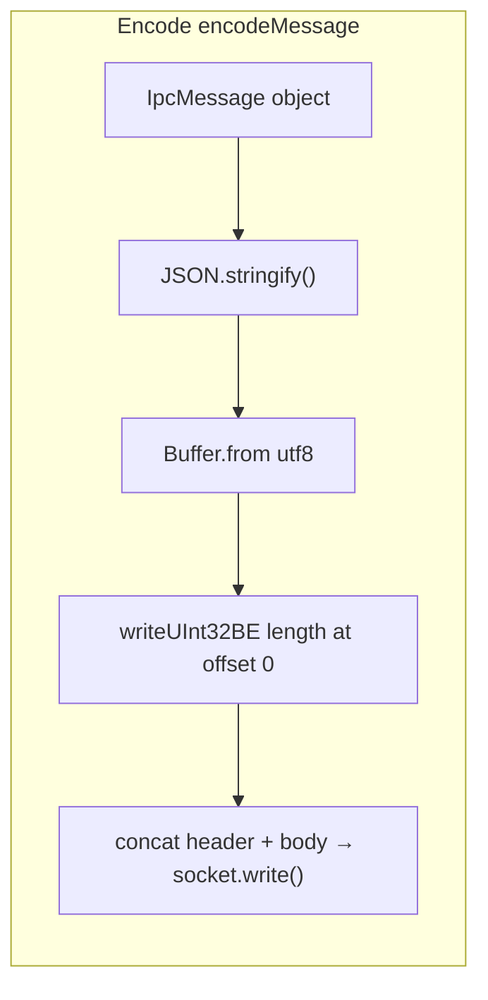
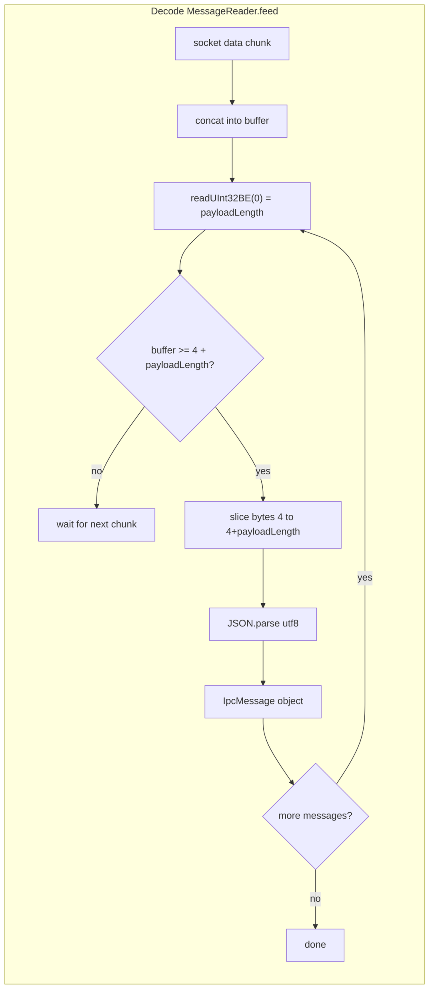
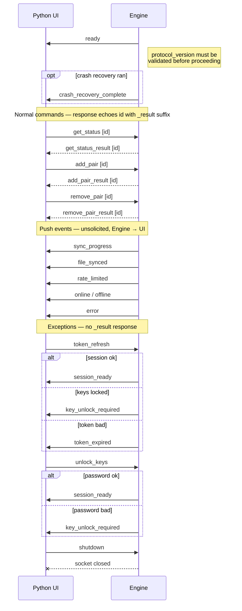

# IPC Protocol

Communication between the Python UI and the TypeScript Engine over a Unix socket.

**Socket path:** `$XDG_RUNTIME_DIR/io.github.ronki2304.ProtonDriveLinuxClient/sync-engine.sock`

---

## Wire Format

Every message in both directions uses the same frame structure.

### Encode — `encodeMessage()`

### Decode — `MessageReader.feed()`

> TCP fragmentation means one `data` event ≠ one complete message. `MessageReader` accumulates chunks in a buffer and loops until no complete message remains.

---

## Message Flow

---

## Message Reference

### Commands (UI → Engine)

| Type | Pattern | Key Payload Fields |
|------|---------|-------------------|
| `token_refresh` | No `_result` — responds via push event | `token` (`"uid:accesstoken"`), `key_password?`, `login_password?`, `captured_salts?` |
| `unlock_keys` | No `_result` — responds via push event | `password` |
| `shutdown` | No `_result` — responds via socket close | — |
| `get_status` | `_result` | — |
| `add_pair` | `_result` | `local_path`, `remote_path` |
| `remove_pair` | `_result` | `pair_id` |
| `update_pair_path` | `_result` | `pair_id`, `new_local_path` |
| `list_remote_folders` | `_result` | `parent_id` (null = root) |

### Responses (Engine → UI)

All responses echo the command `id` field.

| Type | Key Payload Fields |
|------|-------------------|
| `get_status_result` | `pairs[]` (`pair_id`, `local_path`, `remote_path`, `last_synced_at`, `queued_changes`), `online` |
| `add_pair_result` | `pair_id` or `error` |
| `remove_pair_result` | `{}` or `error` |
| `update_pair_path_result` | `{}` or `error` |
| `list_remote_folders_result` | `folders[]` or `error` |

### Push Events (Engine → UI)

Unsolicited — no `id` field.

| Type | Key Payload Fields |
|------|-------------------|
| `ready` | `version`, `protocol_version` |
| `crash_recovery_complete` | — |
| `session_ready` | `key_password?` |
| `session_error` | `code` (`SHARE_KEY_DECRYPT_FAILED`), `message` |
| `token_expired` | `queued_changes` |
| `key_unlock_required` | `error?` (`"unlock_failed"`) |
| `sync_progress` | `pair_id`, `files_done`, `files_total`, `bytes_done`, `bytes_total` |
| `reconcile_progress` | `pair_id`, `phase` (`scanning` / `uploading` / `downloading` / `idle`), `files_processed`, `files_total` |
| `sync_complete` | `pair_id`, `timestamp`, `file_count`, `total_bytes` |
| `queue_replay_complete` | `synced`, `skipped_conflicts` |
| `file_synced` | `pair_id`, `file_name`, `direction` (`upload` / `download` / `verified`), `timestamp` |
| `rate_limited` | `resume_in_seconds` |
| `online` | — |
| `offline` | — |
| `watcher_status` | `status` (`"initializing"` / `"ready"`) |
| `local_folder_missing` | `pair_id`, `local_path` |
| `error` | `code` (`DISK_FULL`, `PERMISSION_DENIED`, `FILE_LOCKED`, `SDK_ERROR`, `DEAD_LETTER`, `sync_cycle_error`, `remote_path_not_found`), `message`, `pair_id?`, `relative_path?` |

---

## Connection Rules

- **Single connection enforced** — a second connection attempt receives `{type:"error", payload:{code:"ALREADY_CONNECTED"}}` then the socket is destroyed immediately.
- **`ready` is always the first event** — emitted synchronously on connect before any command is processed.
- **`protocol_version` must be validated** — UI must check compatibility before sending commands; version mismatch silently corrupts IPC.
- **Backpressure** — if `socket.write()` returns `false`, subsequent writes are queued in FIFO order and flushed on the `drain` event. This preserves the temporal order of `sync_progress` events.
