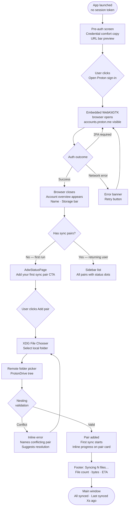
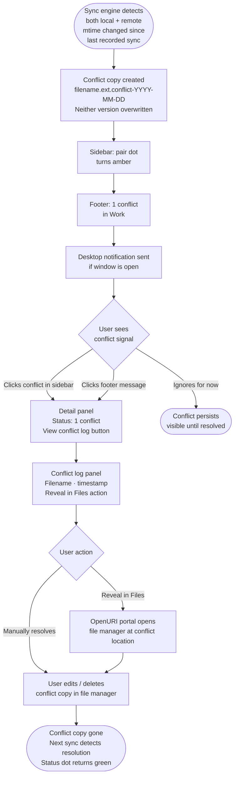
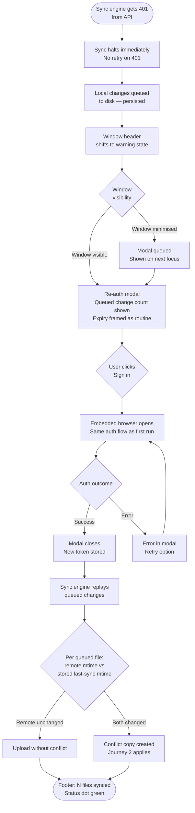

# UX Design Specification - ProtonDrive Linux Client

**Author:** Jeremy
**Date:** 2026-04-06

---

<!-- UX design content will be appended sequentially through collaborative workflow steps -->

## Executive Summary

### Project Vision

ProtonDrive Linux Client is a native GTK4/Libadwaita desktop application that gives Linux users — particularly those on immutable distros like Bazzite, Silverblue, and SteamOS — a first-class, Flathub-native sync client for ProtonDrive. The app solves the WebKitGTK authentication failure that killed every previous community attempt by serving the embedded auth webview over `http://127.0.0.1`, and is built on Proton's official MIT-licensed SDK rather than a reverse-engineered private API.

The product promise is simple: authenticate once, select your folders, sync runs continuously while the app is open. No terminal. No documentation required. Users arriving at this app have been burned by failed alternatives — the UX must signal "this is different" from the first screen.

### Target Users

**Primary — GNOME Linux desktop users** (Fedora, Ubuntu, Silverblue): Paying ProtonDrive subscribers who want "open app, pick folder, sync works." Comfortable installing from GNOME Software or Flathub. Will not use a terminal for setup. Key persona: Layla, 34, developer on Fedora Silverblue, has been manually uploading via browser for two years.

**Secondary — Immutable distro users** (Bazzite, SteamOS): Structurally Flatpak-dependent — the fastest-growing Linux demographic. Flatpak is not a preference for these users, it is the only install path. They need the app to work without any manual permission grants.

**Also real — Security-conscious contributors/auditors**: Users like Tariq (security engineer, NixOS) who read the Flatpak manifest, check the SDK boundary, and verify credential storage before installing. Transparency and open-source legibility are product features for this audience. They are not the largest group but they are vocal and influential.

**Excluded in v1:** KDE/Plasma users (Libadwaita renders but looks out of place), headless/sysadmin use cases (deferred to CLI v2).

### Key Design Challenges

1. **Trust-building before first interaction** — Users arrive burned by DonnieDice (broken auth) and abandoned by rclone/Celeste (archived/delisted). The embedded browser loading Proton's real login page is the first trust signal; the UX must not undermine it with ambiguous transitions or blank intermediate states.

2. **Auth handoff seam** — The embedded WebKitGTK browser is external UI we don't control. The transition from "browser in a window" to "native app UI" must be deliberate: after auth closes, do not dump the user into a blank main window. Show account name, storage, and existing ProtonDrive folders immediately — establish "you're in, here's your world" before asking anything of the user.

3. **Sync status legibility at a glance** — Users need to know the app is working without staring at it. The status panel must communicate all-good / syncing / problem in a single glance, even at small window sizes.

4. **Conflict copy discoverability** — Conflict files land in the same folder as originals with an appended suffix. The in-app conflict log and "Reveal in Files" portal action are the mechanisms; the UX must make finding and understanding conflict copies natural without requiring a file manager.

5. **Re-auth without panic** — A 401 mid-session can feel like imminent data loss. The modal must clearly communicate that queued changes are safe and re-auth is routine — not an error state. Copy should acknowledge password change as a normal trigger: "Your Proton session has expired — this can happen after a password change or routine token refresh."

### Design Opportunities

1. **First-run as confidence builder** — The setup wizard (3 steps: Sign In → Choose Folder → You're Syncing) is a one-shot funnel with no A/B testing after launch. Every screen matters. The contrast effect against failed prior alternatives means a genuinely smooth first-run will drive word-of-mouth on r/linux and r/ProtonMail directly.

2. **Conflict handling as a differentiator** — "It didn't choose for me" is the ideal user reaction. Conflict copy + in-app log + "Reveal in Files" is a complete, respectful conflict UX. Design it to feel deliberate and trustworthy, not defensive.

3. **Transparency as a feature** — The open-source, official-SDK posture and Flatpak permission legibility are product features for the privacy-conscious audience. The Settings > Account section (display name, storage, plan, "Manage account at Proton" external link) communicates "we know what we don't own" — a positive trust signal.

### Key UX Decisions

**Setup wizard structure:**
- 3 screens: Sign In → Choose Your Folder → You're Syncing
- No Back button on the auth step (browser session, server-side state — going back is meaningless)
- Back button on folder selection step
- Wizard runs once only: first launch with no valid session token
- All subsequent launches route directly to the main window

**Account and session management:**
- Log Out clears the session token only; local files and sync pair config are untouched; confirmation copy explicitly states "Your synced local files will not be deleted"
- Change Account is not a v1 or v2 feature; the supported path is manual config flush, documented in the README
- Settings > Account section: display name, storage usage, plan type, "Manage account at Proton" external link — no password fields in the app UI, ever

**Update delivery:**
- Updates delivered exclusively via Flathub OSTree; no in-app updater or update notifications
- AppStream metainfo release notes are the primary user-facing communication channel for changes; treat them as first-class content, not a checkbox

## Core User Experience

### Defining Experience

The core experience of ProtonDrive Linux Client is **sync that disappears**. The primary user action is completing setup once; the ongoing experience is the app working invisibly. After first run, "sync is background noise" — users should only notice the app when something genuinely needs their attention.

The product value is not the sync itself but the absence of friction: no terminal, no configuration file, no manual uploads. The app is done when the user stops thinking about it.

### Platform Strategy

- **Platform:** Linux desktop exclusively — GTK4/Libadwaita, GNOME and GNOME-derived environments as primary targets
- **Display:** Wayland primary (required for Bazzite/SteamOS), X11 via XWayland
- **Input:** Mouse and keyboard; all functions fully operable via keyboard navigation (no pointer-only actions)
- **Distribution:** Flatpak via Flathub — the only delivery channel that reaches immutable distro users; shapes every sandbox and permission decision
- **Offline:** Full offline queuing required — app must show last-synced state and queue local changes when network is unavailable; sync resumes automatically on reconnect without user action

### Effortless Interactions

These interactions must require zero conscious thought from the user:

- **Knowing sync is working** — status panel communicates all-good / syncing / problem at a single glance, even at small window sizes
- **Adding a second sync pair** — available from the main window at any time, no re-running the wizard
- **Finding a conflict copy** — in-app conflict log with "Reveal in Files" portal action; no file manager required
- **Re-authenticating after token expiry** — modal surfaces automatically with queued change count; one click to re-open the auth browser; sync resumes with no lost changes
- **Removing a sync pair** — single action with explicit confirmation; both sides of files remain untouched

### Critical Success Moments

1. **The embedded browser loads Proton's real login page** — user recognises `accounts.proton.me` in the URL bar and trusts what they're looking at; this is the first make-or-break moment
2. **After auth closes: account name and storage appear** — "I'm in, this worked" — the transition from browser to native UI must not land on a blank or loading state
3. **First sync progress is visible** — file count, bytes, ETA; the user doesn't walk away thinking it's broken
4. **First conflict handled correctly** — both versions intact, nothing overwritten, conflict copy locatable in the app — "it didn't choose for me"
5. **Re-auth completes without data loss** — queued changes replay cleanly, no false conflict copies; the 45-second interruption feels routine, not alarming

### Experience Principles

1. **Invisible when healthy** — a syncing app that demands attention has failed; the only reason to notice the app is when something genuinely needs the user

2. **Trust through recognition** — use Proton's real UI for auth, Libadwaita native patterns throughout, XDG portals for file and credential access; nothing should look or behave unfamiliar to a GNOME user

3. **Data safety is non-negotiable** — every destructive-looking action (remove sync pair, log out, conflict resolution) gets explicit confirmation copy that names what will and won't happen to files on both sides

4. **Transparent about its limits** — the app knows what it doesn't own (Proton account password, account management); it says so clearly rather than presenting broken or missing features

5. **Credential comfort by design** — users are typing their Proton password into an embedded browser inside an app they just installed; this is objectively a phishing-shaped situation that must be defused proactively:
   - A native pre-auth screen explains credential mechanics *before* the browser opens: "Your password is sent directly to Proton — this app only receives a session token after you sign in"
   - A read-only URL bar in the embedded WebKitGTK browser shows `accounts.proton.me` so users can verify they are talking to Proton
   - Post-auth confirmation line: "Signed in as [account name] — your password was never stored by this app"
   - About dialog surfaces: MIT license with GitHub link, SDK version in use, Flatpak App ID, link to Flatpak manifest

## User Journey Flows

### Journey 1 — First Run: "It Finally Works"

**Persona:** Layla, Fedora Silverblue, installing from Flathub for the first time.



**Key UX decisions:**
- Pre-auth screen is native GTK4 — shown before browser opens; explains credential mechanics
- Read-only URL bar in embedded browser shows `accounts.proton.me`
- Post-auth: account name + storage bar before any CTA — "I'm in" confirmation
- Empty state uses `AdwStatusPage` — never a blank panel
- Nesting validation at pair confirmation — inline error, not a modal

---

### Journey 2 — Conflict: "I Trust It Got This Right"

**Persona:** Marcus, two Fedora machines, edits same file independently on both while app was closed.



**Key UX decisions:**
- Conflict copy created before any overwrite — data safety guaranteed at the engine level
- Amber dot in sidebar + footer message = two independent signals; user cannot miss it
- "Reveal in Files" via `org.freedesktop.portal.OpenURI` — no file manager required from within the app
- Conflict persists in log until manually resolved — never silently cleared

---

### Journey 3 — Token Expiry: "Don't Just Stall On Me"

**Persona:** Layla, six weeks in, edited files while session token expired.



**Key UX decisions:**
- 401 halts sync immediately — no retry loop
- Queued changes persisted to disk — survive app crash or restart
- Modal copy frames expiry as routine: "can happen after a password change or routine token refresh"
- Modal shows queued change count — "4 local changes are waiting" removes fear of data loss
- Queue replay diffs against current remote state before upload — no false conflict copies

---

### Journey Patterns

**Entry pattern — always informed, never cold:**
Every significant state transition (auth, re-auth, first sync, error) is preceded by a native screen or banner that tells the user what is about to happen. No user lands in an unexpected state without context.

**Feedback pattern — two independent signals for anything urgent:**
Conflicts, errors, and token expiry all trigger both a sidebar/header indicator AND a footer message. Users in different attention states (focused on the app vs. glancing at it) both receive the signal.

**Recovery pattern — named conflict, clear path:**
Every error or conflict state names the specific pair and file involved, and offers a concrete next action. No dead ends. No "something went wrong" without a resolution path.

**Safety pattern — explicit before destructive:**
No file is overwritten without a conflict copy first. No pair is removed without a confirmation dialog that explicitly states what will and won't happen to files on both sides.

### Flow Optimization Principles

1. **Minimum steps to first value:** Auth → account overview → folder picker → sync starts — four steps, no detours
2. **Progress always visible:** First sync shows file count + bytes + ETA inline; no blank waiting states
3. **Errors are information:** Every error state names the cause and offers a resolution; no generic messages
4. **Async by default:** inotify watch tree initialisation, first sync, and change queue replay all run without blocking the UI

## Component Strategy

### Design System Components

The following Libadwaita/GTK4 components are used as-is — no custom implementation needed:

| Component | Used for |
|---|---|
| `AdwNavigationSplitView` | Main sidebar + detail layout with free responsive collapse |
| `AdwHeaderBar` | Window title bar |
| `AdwStatusPage` | Empty state (zero pairs), error states, offline state |
| `AdwActionRow` | Sidebar pair list items, settings rows, conflict log rows |
| `AdwAlertDialog` | Remove pair confirmation, logout confirmation, re-auth modal |
| `AdwBanner` | Conflict notification banner, storage warning at >90% |
| `AdwToastOverlay` | Post-sync confirmation toasts |
| `AdwLevelBar` | Storage usage bar (with threshold colour shift) |
| `AdwPreferencesGroup` | Settings page sections |
| `AdwAboutWindow` | About dialog — MIT license link, SDK version, Flatpak App ID, manifest link |
| `GtkListBox` | Sidebar sync pair list container |
| `GtkProgressBar` | First-sync inline progress on pair card |

### Custom Components

Six custom components are required for UI elements not covered by Libadwaita:

#### SyncPairRow
**Purpose:** Sidebar list item representing one sync pair.
**Anatomy:** Animated status dot (8px circle) + pair name (13px) + optional status text (10px, secondary colour)
**States:** Synced (green dot), Syncing (teal dot, pulsing animation), Conflict (amber dot), Error (red dot), Offline (grey dot), Selected (teal background tint)
**Accessibility:** Dot state communicated via accessible label ("Documents — synced / syncing / 1 conflict / error / offline"), not colour alone
**Implementation:** `GtkListBoxRow` subclass with custom `GtkBox` layout

#### StatusFooterBar
**Purpose:** Persistent bottom bar showing global sync state across all pairs.
**Priority logic:** Error > Conflict > Syncing > Offline > All synced — most urgent state always shown
**Anatomy:** Status indicator (6px dot or icon) + primary state text + separator + secondary detail (file count, pair name)
**States:** All synced (green dot), Syncing (teal dot, animated) + "Syncing N files in [pair]…", Conflict (amber dot) + "N conflicts need attention", Error (red dot) + "Sync error in [pair]", Offline (grey dot) + "Offline — changes queued"
**Implementation:** `GtkBox` pinned at bottom of main window via `GtkOverlay` or window layout

#### RemoteFolderPicker
**Purpose:** Let user select a ProtonDrive folder as the remote side of a sync pair.

**MVP implementation (text input + autocomplete):**
- Text field pre-filled with local folder name (e.g. `/Documents`)
- Typing fetches top-level ProtonDrive folders as autocomplete suggestions — one SDK call, result cached for session lifetime of the dialog
- Manual path entry supported for nested paths (e.g. `/Work/Projects/2026`)
- "Browse folders…" link present but deferred to V1

**V1 implementation (full tree browser):**
- `GtkTreeView` with `GtkTreeStore`, lazy-loaded on row expand
- Per-row loading spinner during SDK `listFolder()` call
- Expansion requests debounced; fetched folder contents cached for session
- Keyboard navigation: arrow keys to navigate, Enter/Space to expand, Enter on leaf to select
- Rate limit handling: exponential backoff on SDK errors, visible "loading…" state

**Accessibility:** Full keyboard navigation required; tree rows announce folder name + expanded/collapsed state

#### SyncProgressCard
**Purpose:** Detail panel state shown during first sync and subsequent syncs.
**Anatomy:** "Syncing" header + `GtkProgressBar` (indeterminate until file count known, then determinate) + file count label + bytes transferred / total label + ETA label
**States:** Initialising (indeterminate bar + "Counting files…"), Active (determinate bar + count/bytes/ETA), Complete (transitions to normal detail stats after 2s)
**Implementation:** Replaces the stats cards in the detail panel during active sync

#### ConflictLogRow
**Purpose:** Single entry in the conflict log panel.
**Anatomy:** Warning icon + filename (bold, amber) + pair name + timestamp + "Reveal in Files" action link
**Actions:** "Reveal in Files" → `org.freedesktop.portal.OpenURI` opens file manager at conflict file location
**States:** Unresolved (amber), Resolved (dimmed, strikethrough filename — auto-detected when conflict copy deleted)
**Implementation:** `AdwActionRow` subclass with custom suffix widget for "Reveal in Files" link

#### AccountHeaderBar
**Purpose:** Always-visible strip showing account identity and storage state.
**Anatomy:** Avatar (28px circle, initials) + account name (13px, medium weight) + storage bar (`AdwLevelBar`, min-width 140px) + storage label ("47 GB / 200 GB", 10px)
**States:** Normal (teal fill on bar), Warning at >90% full (`@warning_color` fill + amber label), Critical at >99% (error colour + "Storage full" label)
**Implementation:** `GtkBox` as first child of main window content area, below `AdwHeaderBar`

### Component Implementation Strategy

- All custom components use Libadwaita CSS tokens exclusively — no hardcoded colours
- Custom teal accent applied via CSS class referencing `--accent-color` override, not inline styles
- Status dot animations use CSS `@keyframes` with `animation: pulse` — GPU-accelerated, no timer-based redraws
- All custom components expose AT-SPI2 accessible names and roles via `gtk_accessible_*` APIs

### Implementation Roadmap

**Phase 1 — MVP critical path:**
1. `AccountHeaderBar` — needed for post-auth landing screen
2. `SyncPairRow` — needed for sidebar (core layout)
3. `StatusFooterBar` — needed for main window (core layout)
4. `RemoteFolderPicker` (text input + autocomplete variant) — needed for pair setup
5. `SyncProgressCard` — needed for first sync experience
6. `ConflictLogRow` — needed for conflict handling journey

**Phase 2 — V1:**
- `RemoteFolderPicker` full tree browser (`GtkTreeView` variant) behind "Browse folders…" link

## UX Consistency Patterns

### Button Hierarchy

| Level | Libadwaita style | When to use |
|---|---|---|
| Primary | `suggested-action` (teal) | One per screen — the single most important next step (Sign in, Confirm pair, Start sync) |
| Secondary | Default button | Supplementary actions (View conflict log, Settings) |
| Destructive | `destructive-action` (red) | Irreversible actions — Remove pair, Log out |
| Ghost / inline | Text link style | Low-emphasis actions — "Browse folders…", "Reveal in Files" |

**Rules:**
- Never more than one primary button visible at a time
- Destructive buttons never adjacent to primary buttons — always separated by distance or a divider
- Cancel is always the default/escape action in dialogs — never the destructive action

### Feedback Patterns

| Situation | Pattern | Component | Dismissal |
|---|---|---|---|
| Sync completed | Toast "N files synced" | `AdwToastOverlay` | Auto-dismisses after 3s |
| Conflict detected | Persistent amber banner + sidebar dot | `AdwBanner` + `SyncPairRow` | User-dismissed |
| Storage >90% full | Persistent amber banner | `AdwBanner` | User-dismissed |
| Sync error | Persistent red banner in detail panel, names pair and cause | `AdwBanner` | User-dismissed after resolution |
| Re-auth required | Modal dialog — blocks until resolved | `AdwAlertDialog` | Resolved by signing in |
| Rate limited | Footer: "Sync paused — resuming in Xs" | `StatusFooterBar` | Auto-clears when resumed |
| inotify initialising | Footer: "Initialising file watcher…" | `StatusFooterBar` | Auto-clears when complete |

**Rules:**
- Toasts for transient positive feedback only — never for errors or states requiring attention
- Banners for persistent states requiring user awareness — always dismissible
- Modals only for states requiring immediate user action (re-auth) — used sparingly

### Form Patterns

- Remote folder name pre-filled from local folder name — reduces required input to zero in the common case
- Validation runs at confirmation, not on every keystroke — no aggressive inline validation
- Validation errors shown inline below the relevant field — never a separate error dialog
- Error copy names the conflict specifically: *"This folder is already synced by your 'Documents' pair"*
- No required field asterisks — every input is self-explanatory from its label

### Navigation Patterns

- Sidebar selection drives detail panel — single click, immediate update
- `AdwNavigationSplitView` collapses on narrow windows — back button appears; sidebar hidden until tapped
- No browser-style back/forward history — this is a utility app, not a document browser
- Settings accessible via gear icon in `AdwHeaderBar` → `AdwPreferencesWindow`
- About dialog via standard GNOME `⋯` menu in header bar

### Empty States and Loading States

| State | Pattern |
|---|---|
| Zero sync pairs (first run post-auth) | `AdwStatusPage` with teal CTA: "Add your first sync pair to start syncing" |
| Detail panel, no pair selected | `AdwStatusPage`: "Select a sync pair to see details" |
| Remote folder picker loading | Inline spinner in text field — not a blocking overlay |
| inotify watch tree initialising | Footer state — UI remains fully interactive |
| App opened offline | Banner with last-synced timestamps per pair — never a blank screen |

**Rule:** No blank panels. No spinners without a label. Every loading state names what is loading and why.

### Destructive Action Pattern

All three destructive actions (remove sync pair, log out, clear credentials) follow the same consistent pattern:

1. User clicks the `destructive-action` styled button
2. `AdwAlertDialog` appears immediately — heading names the action, body copy explicitly states what **will** and **will not** be affected
3. Dialog has exactly two buttons: **Cancel** (default/escape, suggested-action style) and the destructive action (destructive-action style)
4. No "I understand" checkbox — the copy itself is the safeguard

**Example body copy for "Remove sync pair":**
> *"Stop syncing this folder pair? Local files in `~/Documents` will not be affected. Remote files in `ProtonDrive/Documents` will not be affected. Sync will simply stop."*

**Example body copy for "Log out":**
> *"Sign out of your Proton account? Your synced local files will not be deleted. You will need to sign in again to resume sync."*

## Responsive Design & Accessibility

### Responsive Strategy

This is a Linux desktop application only — no mobile or tablet targets. "Responsive" means correct behaviour across different window sizes on a Linux desktop, from a compact 360px-wide window to a maximised 4K display.

| Window width | Layout behaviour |
|---|---|
| < 480px | `AdwNavigationSplitView` collapses — sidebar hidden, detail panel fills window, back button appears in header bar |
| 480px – 720px | Split view active — sidebar at minimum width (~180px), detail panel fills remainder |
| 720px+ | Standard split — sidebar ~220px fixed, detail panel fills |
| 1200px+ | No additional layout changes — extra width absorbed by detail panel content |

- **Minimum window size:** 360×480px — GTK minimum size hint enforced; below this the layout is unusable
- **Default window size:** 780×520px — saved and restored between sessions via `$XDG_STATE_HOME`
- **Wayland / X11:** Layout identical on both display servers; no display-server-specific layout code required

### Breakpoint Strategy

GTK4 `AdwNavigationSplitView` handles the single relevant breakpoint automatically — the sidebar collapses below its minimum width threshold. No custom media queries or manual breakpoint handling needed.

The only manual breakpoint consideration: the `AccountHeaderBar` storage label ("47 GB / 200 GB") truncates gracefully at narrow widths — label hidden at < 480px, storage bar remains.

### Accessibility Strategy

**Target: WCAG AA** — required by NFR18–20 (AT-SPI2 tree, full keyboard navigation, WCAG AA contrast).

| Requirement | Implementation |
|---|---|
| Contrast 4.5:1 for body text | Libadwaita dark tokens — pre-validated |
| Contrast 3:1 for large text | Libadwaita dark tokens — pre-validated |
| Teal accent (`#0D9488`) on dark background | Verified ≥ 4.5:1 against Libadwaita dark base |
| Keyboard navigation | All interactive widgets tab-focusable; no pointer-only actions anywhere in the app |
| Screen reader (Orca / AT-SPI2) | Automatic for standard GTK4/Libadwaita widgets; custom components (`SyncPairRow`, `StatusFooterBar`, `ConflictLogRow`) require explicit `gtk_accessible_*` API calls |
| Status dots (colour-only state) | Each dot carries an accessible label: "Documents — synced / syncing / 1 conflict / error / offline"; colour is a visual enhancement, not the sole state signal |
| Focus indicators | GTK4 default focus rings used — never suppressed via CSS |
| Font size user override | System font (Cantarell) inherited; user font size accessibility settings respected throughout |
| Touch targets | Not applicable — Linux desktop, pointer device assumed |

### Testing Strategy

**Keyboard navigation testing (before each release):**
- Complete all three critical journeys (first run, conflict handling, re-auth) using keyboard only — Tab, Enter, Space, Escape, arrow keys
- Verify no focus trap exists anywhere except modal dialogs (where focus trap is correct)
- Verify Escape closes all dialogs and banners

**Screen reader testing (Orca):**
- Main window sidebar: all pair names and states announced correctly
- Pair setup flow: all inputs, labels, and validation errors announced
- Conflict log: conflict filenames and "Reveal in Files" action announced
- Re-auth modal: queued change count and action buttons announced

**Window resize testing:**
- 360px, 480px, 720px, 1200px widths — verify no content clipped or inaccessible
- Verify `AdwNavigationSplitView` collapse/expand transition at ~480px threshold
- Verify `AccountHeaderBar` label truncation at narrow widths

**Colour contrast verification:**
- Teal `#0D9488` against Libadwaita dark background: verify ≥ 4.5:1 using contrast checker
- All status state labels (not dots) verified for contrast

### Implementation Guidelines

- Use `gtk_accessible_update_property()` and `gtk_accessible_update_state()` for all custom component state changes — never rely on visual changes alone
- `GtkListBoxRow` subclasses must set `GTK_ACCESSIBLE_ROLE_LIST_ITEM` and update their accessible label when sync state changes
- `StatusFooterBar` must announce state changes to AT-SPI2 using `GTK_ACCESSIBLE_STATE_LIVE` (polite, not assertive — sync status changes are not urgent interrupts)
- Minimum interactive element size: 28×28px logical pixels (compact density); GTK touch target padding not required for desktop-only app but recommended for usability
- Never use colour as the sole means of conveying information — all status dots, storage bar states, and error indicators are accompanied by text labels

## Desired Emotional Response

### Primary Emotional Goals

The primary emotional goal is **trust so deep users stop thinking about the app**. This is achieved through a sequence of smaller emotional wins — each critical moment must land correctly for the next to build on it. Users arrive carrying anxiety from failed alternatives; the emotional arc is a deliberate unwinding of that anxiety into quiet confidence.

### Emotional Journey Mapping

| Moment | Target Emotion | Risk to Avoid |
|---|---|---|
| First discovery (Flathub listing, Reddit post) | Cautious hope — "maybe this one actually works" | Overpromising; failing to differentiate from DonnieDice |
| Pre-auth screen | Informed, not anxious — "I know what's about to happen" | Landing cold in a browser with no context |
| Auth browser open | Recognition — "that's Proton's real login page" | Suspicion that the embedded browser is a phishing facade |
| Post-auth account overview | Relief + confirmation — "it worked, I can see my account" | Blank or loading state after browser closes |
| First sync running | Calm confidence — "it's doing something, I don't need to watch it" | Silence — no feedback that anything is happening |
| First conflict handled | Respect — "it didn't choose for me, my data is safe" | Silent overwrite; discovering data was lost |
| Token expiry re-auth | Routine, not alarmed — "just a sign-in, nothing was lost" | Fear that queued changes are gone |
| Removing a sync pair | Control — "I decided this, nothing happened without my say" | Uncertainty about whether files were deleted |
| Long-term daily use | Trust so deep they stop thinking about it | Anxiety spikes from unexplained state changes |

### Micro-Emotions

These subtle emotional states have outsized impact on perceived quality:

- **Informed vs. anxious** — at the auth handoff; the pre-auth native screen is the primary mechanism
- **Confirmed vs. uncertain** — after first sync completes; explicit "last synced X seconds ago" removes residual doubt
- **Respected vs. overruled** — at conflict detection; the conflict copy pattern delivers this; silent overwrites destroy it
- **In control vs. helpless** — at every error state; each error must name what happened and what the user can do next; no dead ends

**Emotions to avoid at all costs:**
- Anxiety about whether sync is actually working
- Fear that a destructive action (remove pair, log out) will delete files
- Suspicion that the app is doing something unexpected with credentials or files
- Confusion about the app's current state

### Design Implications

| Emotion | UX Design Approach |
|---|---|
| Calm confidence | Status panel always visible; no blank or indefinitely-spinning states; clear "last synced X seconds ago" timestamp |
| Recognition and trust | Read-only URL bar in embedded browser; Proton's real login page; Libadwaita native patterns throughout |
| Informed at transitions | Pre-auth screen before browser opens; post-auth confirmation line; explicit copy on all destructive actions |
| Respect and safety | Conflict copies over silent overwrites; "no files will be deleted" language on every removal confirmation |
| Routine re-auth | Modal shows queued change count; copy frames expiry as normal ("can happen after a password change or routine token refresh") |

### Emotional Design Principles

1. **Never leave the user in ambiguity** — every state the app can be in (syncing, offline, error, rate-limited, token expired) must be named and visible; unknown state is the fastest path to anxiety
2. **Earn trust incrementally** — each screen in the first-run wizard completes an emotional promise before asking for the next commitment; don't ask for a folder before the user knows auth worked
3. **Make safety explicit, not implied** — users who chose Proton for privacy will not infer safety from the absence of scary things; name it directly in copy at every relevant moment
4. **Treat errors as information, not failures** — error states should tell the user what happened, what is safe, and what their next action is; no dead ends, no silent failures

## UX Pattern Analysis & Inspiration

### Inspiring Products Analysis

**Spotify** is the primary UX inspiration source. Despite being a media player, Spotify is fundamentally a background-operation manager — it buffers, downloads, and syncs content continuously while presenting a completely calm, status-light experience. Users never worry whether Spotify is working. This is the exact mental model ProtonDrive Linux Client needs to cultivate: "it's running, I don't need to watch it."

Key Spotify UX attributes relevant to this product:
- A persistent status bar always shows current state regardless of what screen is active — users always know
- Sidebar navigation lists "library items" (playlists) each with their own micro-status indicator — downloaded, unavailable, syncing
- Progress is shown inline on items, not in blocking modal dialogs
- Empty states are never actually empty — recent activity, suggestions, or CTAs fill the space
- Dark theme is mandatory and non-negotiable — a brand signal, not a setting

**Target user alignment:** Dark theme preference in the Linux developer/power user demographic is near-universal (~80%+ in surveys). Bazzite/SteamOS users (gamers), Fedora developers, and privacy-conscious engineers all default to dark. Forcing dark is audience alignment, not a constraint.

### Transferable UX Patterns

**Navigation & Layout:**
- **Persistent footer status bar** — always-visible sync state (syncing X files / all synced / offline / conflict count) with a subtle animation icon during active sync; equivalent to Spotify's now-playing bar
- **Sidebar with sync pair list** — each pair shows its own colour-coded status dot (green = synced, blue = syncing, yellow = conflict, red = error, grey = offline); scan the list and know everything instantly
- **Account header** — always-visible strip showing account name and storage usage bar; colour shifts to amber at ~90% full

**Information Hierarchy (always visible, no dialogs required):**
```
┌─────────────────────────────────────┐
│ [Account name]  [47GB / 200GB ████░] │  ← account header
├──────────┬──────────────────────────┤
│ Sync     │                          │
│ Pairs    │   [Selected pair detail] │
│          │                          │
│ ● Docs ✓ │                          │
│ ● Proj ↻ │                          │
│ ● Work ⚠ │                          │
│          │                          │
│ + Add    │                          │
├──────────┴──────────────────────────┤
│ ↻ Syncing 3 files · 4s ago · 2.1MB  │  ← persistent footer
└─────────────────────────────────────┘
```

**Progress & Status:**
- Sync progress shown inline on each sync pair card — file count, last-synced time, status dot
- Storage bar is a proactive safety feature: colour shift at ~90% full prevents silent sync failures due to quota exhaustion; warning is a banner, never a modal
- Per-pair conflict state visible in sidebar without opening anything

**Never-empty states:**
- Post-auth screen: account name, storage bar, existing ProtonDrive folders, CTA to add first sync pair
- No sync pairs configured: show storage overview + prominent "Add your first sync pair" CTA
- Offline with no recent activity: show last-synced timestamps per pair + offline indicator

### Anti-Patterns to Avoid

- **Modal progress dialogs** — never block the UI for sync progress; show inline on the relevant pair card
- **Blank states** — never show an empty content area after auth, between syncs, or on first launch with no pairs
- **Modal storage warnings** — a colour shift on the storage bar + dismissible banner is the correct pattern; dialogs interrupt flow
- **Custom dark palette bypassing Libadwaita** — rolling a custom dark theme breaks Libadwaita's accessible contrast tokens; use `AdwStyleManager` with `ADW_COLOR_SCHEME_FORCE_DARK` to preserve all contrast guarantees
- **Silent failures** — every error state (quota exceeded, network lost, auth expired, rate limited) must be visible in the status bar and/or per-pair indicator; no background failures the user discovers by noticing files didn't sync

### Design Inspiration Strategy

**Adopt directly:**
- Spotify's persistent status bar pattern → persistent footer sync status bar
- Spotify's sidebar micro-status indicators → per-pair status dots in sync pair list
- Spotify's inline progress (not modal) → sync progress on pair cards
- Spotify's never-empty states → meaningful content at every screen state

**Adapt for platform:**
- Spotify's dark theme → mandatory dark via `AdwStyleManager` `ADW_COLOR_SCHEME_FORCE_DARK`; Libadwaita tokens handle the rest
- Spotify's "now playing" persistent bar → sync status footer with file count, last-synced time, and transfer indicator

**Adopt for this product's unique needs:**
- Storage bar as proactive safety feature (not just decoration) — colour shift at 90% full, banner warning, never modal
- Remote folder size per pair deferred to v1+ (requires expensive remote tree traversal; cache, don't fetch live)
- Transfer speed display optional for MVP; aggregate throughput in footer is sufficient

## Design Direction Decision

### Design Directions Explored

Four visual directions were generated and evaluated against the confirmed foundation (GTK4/Libadwaita dark, teal `#0D9488`, compact density). Reference mockups: `ux-design-directions.html`.

| Direction | Description | Assessment |
|---|---|---|
| A — Sidebar + Detail | Classic GNOME two-panel; sidebar list with status dots; selected pair in detail panel | **Chosen** |
| B — Compact cards | All pairs as scrollable cards; no detail panel; status pills inline | Better for many pairs; less room for conflict management |
| C — Dashboard + Activity | Stats header; activity feed per pair | Implies user should watch the app — contradicts "invisible when healthy" |
| D — Wide sidebar | 280px sidebar with inline detail; conflict panel on right | Efficient for power users; more complex layout |

### Chosen Direction

**Direction A — Sidebar + Detail panel**

Uses GTK4's `AdwNavigationSplitView` — the standard Libadwaita two-panel component used by GNOME Files, Settings, Evolution, and Geary. Target users know this layout without thinking.

### Design Rationale

- **Native pattern recognition:** GNOME users have used this layout a hundred times; zero learning curve
- **At-a-glance status:** Sidebar status dots give instant state for all pairs without clicking — three green dots, window closed, user confident
- **Room for detail:** Detail panel provides space for conflict log, stats, path display, and actions without crowding
- **Free responsive behaviour:** `AdwNavigationSplitView` collapses gracefully on narrow windows; no custom responsive code
- **Audit-friendly:** Pair-focused layout communicates "the app knows about these folders and nothing else"
- **Lowest implementation risk:** Every element maps directly to a standard GTK4/Libadwaita widget

### Implementation Approach

- `AdwNavigationSplitView` for main layout — responsive collapse built in
- `AdwHeaderBar` with custom content for account header
- `GtkListBox` with `AdwActionRow` for sidebar pair list
- `GtkBox` at window bottom for persistent footer status bar
- `AdwStatusPage` for empty state (zero pairs configured)

### Refinements Locked

1. **Status card prominence** — Status stat in detail panel gets larger text and colour-coding (green/amber/red); first thing the eye lands on when selecting a pair
2. **Destructive action styling** — "Remove pair" uses Libadwaita destructive button CSS class, visually separated from safe actions
3. **Empty state** — zero pairs: `AdwStatusPage` in detail area with teal CTA "Add your first sync pair to start syncing"; sidebar shows only `[+ Add Pair]`
4. **Storage bar prominence** — first element rendered post-auth; colour shifts to `@warning_color` at ~90% full
5. **Auth screen** — pre-auth native screen before embedded browser; read-only URL bar shows `accounts.proton.me`

## Defining Core Experience

### Defining Experience

> **"Pick a folder. Watch it sync. Never think about it again."**

This is a three-act promise, not a single gesture:
1. **Setup is so simple** you do it without thinking — zero terminal, zero documentation
2. **Sync confirmation is so clear** you immediately trust it — you saw it sync, you trust it synced
3. **Ongoing operation is so invisible** you forget the app exists — it is background noise

### User Mental Model

Users arrive with one of two mental models:

**Dropbox/pCloud veterans:** Understand sync pairs intuitively; expect a folder on their filesystem that stays in sync; look for a tray icon or status indicator. They will scan the sidebar and status bar first.

**Manual uploader refugees:** Have been dragging files to the ProtonDrive browser; understand "my files go to ProtonDrive" but not continuous sync. The concept of automatic background sync will feel like magic if it works — and like anxiety if it is silent.

Both groups share the same fear: **silent failure.** They have been let down before. The mental model to build is "I saw it sync, I trust it synced." Every status signal in the app exists to serve this need.

### Success Criteria

- User completes first sync pair setup without opening documentation or a terminal
- First sync progress is visible immediately — file count, bytes, ETA — no blank waiting state
- After first successful sync, "Last synced X seconds ago" is visible without opening any panel
- A user with 3 sync pairs can determine the state of all 3 by glancing at the sidebar
- A conflict is found and both versions are locatable without opening a file manager

### Novel UX Patterns

**Established patterns used throughout — no user education required:**
- XDG File Chooser portal for folder selection (GNOME standard)
- Libadwaita sidebar + detail panel layout (standard GNOME app pattern)
- Inline progress bars on items (standard)
- Desktop notifications for conflicts (standard GNOME notification pattern)

**One novel pattern — pre-auth native screen:** Before the embedded browser opens, a native GTK4 screen explains what is about to happen and why it is safe. No existing Linux sync client does this exactly, but it maps to the familiar "read this before you proceed" mental model — no user education required.

### Experience Mechanics

**Main window layout — sidebar + detail:**

```
┌─────────────────────────────────────────┐
│ 👤 jeremy@proton.me  [47GB/200GB ████░] │  ← account header
├─────────────────┬───────────────────────┤
│ My Sync Pairs   │  Documents            │
│ ─────────────   │  ─────────────────── │
│ ● Documents  ✓  │  ~/Documents          │
│ ● Projects   ↻  │  ↕ ProtonDrive/Docs  │
│ ● Work       ⚠  │                      │
│                 │  Last synced: 4s ago  │
│                 │  1,247 files · 2.1 GB │
│                 │  Status: All synced ✓ │
│ [+ Add Pair]    │                       │
│                 │  [Remove pair]        │
├─────────────────┴───────────────────────┤
│ ↻ Projects syncing 3 files…             │  ← persistent footer
└─────────────────────────────────────────┘
```

**Core flow — first run:**

| Phase | What happens | User signal |
|---|---|---|
| App open | Pre-auth native screen | Informed, not cold — credential mechanics explained |
| Auth | Embedded browser | URL bar shows `accounts.proton.me` |
| Post-auth | Account overview appears | Name + storage bar — "I'm in" |
| Setup | XDG folder picker | Native GNOME dialog — familiar |
| First sync | Progress inline on pair card | File count + bytes + ETA |
| Steady state | Footer: "Last synced 4s ago" | Teal dot — invisible when healthy |

**Adding subsequent pairs:**
- `[+ Add Pair]` pinned at bottom of sidebar — always visible, never in settings
- Lightweight flow: local folder picker → remote folder picker → pair added, sync starts
- No wizard chrome — user already knows how sync works

**Footer priority order (most urgent wins):**
`Error > Conflict > Syncing > Offline > All synced`

### Multi-Pair Sync Rules

**Nested and overlapping sync pairs are hard-blocked at pair creation. No override path.**

Four validation checks run before any new pair is written to the database:

| Check | Condition | Error copy direction |
|---|---|---|
| Local nesting | New local path is inside an existing pair's local path | Name conflicting pair, explain duplicate file risk |
| Local overlap | Existing pair's local path is inside new local path | Name conflicting pair |
| Remote nesting | New remote path is inside an existing pair's remote path | Name conflicting pair |
| Remote overlap | Two pairs point to the same remote folder | "Already in use by [pair name]" |

Error messages are specific: name the conflicting pair, explain the risk, suggest a resolution. For the subfolder-to-different-remote case: acknowledge it as a planned future feature.

**Local folder deleted or moved:** Pair shows a dedicated error state in the sidebar — not a global error. Copy: *"Local folder not found at `[path]`. Was it moved? [Update path] [Remove pair]"* The pair is never silently dropped from the list.

## Visual Design Foundation

### Color System

| Token | Value | Usage |
|---|---|---|
| Accent | `#0D9488` (deep teal) | CTAs, active states, sync progress, status dot (syncing) |
| Success | Libadwaita `@success_color` | Status dot (synced), success banners |
| Warning | Libadwaita `@warning_color` | Status dot (conflict), storage bar >90%, warning banners |
| Error | Libadwaita `@error_color` | Status dot (error), error banners |
| Offline | Libadwaita `@dim_label_color` | Status dot (offline), greyed pair names |
| All surfaces | Libadwaita dark palette | Backgrounds, cards, sidebars, all structural elements |

One accent colour owned (`#0D9488`). All semantic colours inherited from Libadwaita system tokens — never overridden. WCAG AA contrast requirements met automatically: teal on Libadwaita dark background exceeds 4.5:1 ratio; all other semantic tokens are pre-validated by the Libadwaita design system.

### Typography System

- **Primary font:** Cantarell — system font inherited from GNOME, not overridden
- **Type scale:** Libadwaita default scale used as-is — `AdwWindowTitle`, `AdwActionRow`, body, caption
- **No custom fonts** — respects user accessibility settings (font size overrides, dyslexia fonts, high-contrast modes)
- **Rationale:** Overriding the system font for a utility app provides no user value and breaks accessibility font overrides

### Spacing & Layout Foundation

**Density:** Compact — suits a utility app users glance at rather than read; maximises information visible at small window sizes; critical for multi-pair sidebar legibility.

**Spacing scale:**

| Level | Value | Usage |
|---|---|---|
| Micro | `4px` | Internal component padding, icon-to-label gaps |
| Base | `8px` | Standard element spacing, list item internal padding |
| Section | `16px` | Between distinct UI sections, card margins |

**Layout structure:**

| Region | Size | Notes |
|---|---|---|
| Account header | 48px height | Always visible; account name + storage bar |
| Sidebar | ~220px fixed width | Sync pair list; scrollable; `[+ Add Pair]` pinned at bottom |
| Detail panel | Fills remaining width | Selected pair detail; last-synced, file count, status, actions |
| Footer status bar | 36px height | Always visible; global sync state; most urgent status wins |

### Accessibility Considerations

- **HiDPI:** Fully system-managed — GTK4 + Wayland compositor handles device pixel ratio automatically; UI specified in logical pixels; no app-level scaling code required
- **Icons:** Symbolic SVG icons throughout — scale to any DPI with no pixelation; provided at 48×48, 64×64, 128×128 PNG + SVG for app icon
- **Contrast:** WCAG AA guaranteed by Libadwaita tokens; custom teal accent verified to exceed 4.5:1 on dark background
- **Keyboard navigation:** All functions operable without pointer — Libadwaita widget tab order and focus rings inherited by default
- **Screen reader:** AT-SPI2 accessibility tree exposed automatically by GTK4 widgets; status dots require accessible labels (not colour-only state communication)
- **Font scaling:** System font inherited; user font size overrides respected; no hardcoded pixel font sizes
- **Status communication:** All status states communicated via text label + colour — never colour alone

## Design System Foundation

### Design System Choice

**GTK4 + Libadwaita** with mandatory dark theme enforced via `adw_style_manager_set_color_scheme(ADW_COLOR_SCHEME_FORCE_DARK)`.

This is not a trade-off decision — it is the only correct choice for a GNOME-native Flatpak targeting Flathub. Libadwaita is the expected design language for this platform, audience, and distribution channel.

### Rationale for Selection

- **Platform native:** Libadwaita is the GNOME design system; immutable distro users (Bazzite, Silverblue) encounter it constantly — it is their system vocabulary
- **Accessibility built-in:** AT-SPI2, full keyboard navigation, and WCAG AA contrast are guaranteed by Libadwaita's token system; a custom system would require revalidating all of this from scratch
- **Flathub compliance:** Flathub reviewers expect Libadwaita compliance for GNOME-targeted apps
- **Dark theme as brand signal:** Mandatory dark is audience alignment — Linux developer/power user dark theme preference is near-universal; forcing dark via `AdwStyleManager` keeps all contrast tokens valid

### Brand Identity & Colour Strategy

**This app is not Proton. It must not look like Proton.**

Using Proton purple would create implicit endorsement claims the project cannot support, risk confusion with any future official Proton client, and undermine the independent community identity the project needs for long-term credibility. Every successful third-party cloud sync client (Thunderbird for Gmail, Celeste, Nextcloud) maintains a distinct visual identity from the service it connects to.

**Accent colour: deep teal `~#0D9488`**

Teal signals privacy-tech, trustworthy, open source, and Linux-native without copying any competitor. Signal, Bitwarden, and ProtonVPN's secondary palette all use teal for the same values — it is established vocabulary for this exact audience. On a dark Libadwaita background it is visually distinct and legible. It ages well; purple is currently saturated in the privacy-tech space.

**Complete colour palette:**

| Role | Colour | Source |
|---|---|---|
| Accent / CTAs / active states / sync progress | `#0D9488` (deep teal) | Custom — one owned colour |
| Synced / success | Libadwaita semantic green | System token — do not override |
| Conflict / warning | Libadwaita semantic amber | System token — do not override |
| Error | Libadwaita semantic red | System token — do not override |
| All other UI | Libadwaita dark palette | System tokens — do not override |

One accent colour owned. Everything else inherited from the system.

### Implementation Approach

- `AdwStyleManager` with `ADW_COLOR_SCHEME_FORCE_DARK` — one call at app startup
- Custom accent applied via Libadwaita's `AdwAccentColor` API — teal is distinct enough from GNOME's default blue to establish identity without fighting system tokens
- `AdwLevelBar` for storage bar — standard widget with colour threshold at ~90% full
- Status dots use Libadwaita semantic colour tokens (success/warning/error) — no custom colours for status states
- App icon: simple stylised file-sync or shield-with-arrows motif in teal on dark background; legible at 48×48

### Customisation Strategy

Minimise custom styling. The teal accent colour is the single point of brand expression. All other visual decisions defer to Libadwaita defaults. This keeps:
- Accessibility guarantees intact
- System font (Cantarell) respected — user accessibility settings honoured
- Future Libadwaita updates non-breaking
- Development complexity low — one accent to maintain, not a full custom theme
