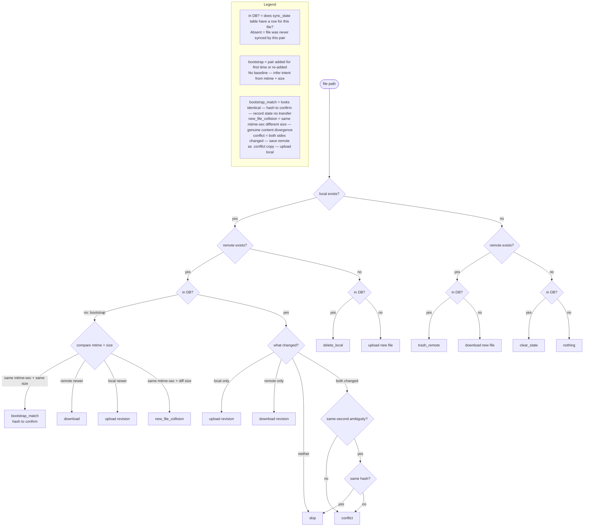

# Sync Decision Table

The `computeWorkList` function in `engine/src/sync-engine.ts` compares local files, remote files, and the sync state database to produce a list of work items for each reconcile cycle.

---

## Decision Flowchart

---

## Work Item Outcomes

| Outcome | Condition | Action |
|---------|-----------|--------|
| `upload` new file | local only, not in DB | New local file — upload to remote |
| `upload` revision | local + remote, in DB, local changed | Local newer than last sync — push revision |
| `download` new file | remote only, not in DB | New remote file — download to local |
| `download` revision | local + remote, in DB, remote changed | Remote newer than last sync — pull revision |
| `delete_local` | local only, in DB | Remote was deleted since last sync — remove local copy |
| `trash_remote` | remote only, in DB | Local was deleted since last sync — trash remote node |
| `bootstrap_match` | local + remote, not in DB, same mtime-sec + same size | Looks identical — hash to confirm — record state, no transfer |
| `upload` revision (bootstrap) | local + remote, not in DB, local newer | Local is ahead — upload revision, pre-seed sync state |
| `download` (bootstrap) | local + remote, not in DB, remote newer | Remote is ahead — download |
| `new_file_collision` | local + remote, not in DB, same mtime-sec + different size | Genuine content divergence — treat as conflict |
| `conflict` | local + remote, in DB, both changed | Save remote as `.conflict-YYYY-MM-DD` copy — upload local to win |
| `clear_state` | not local, not remote, in DB | Both sides deleted — remove stale DB row |
| skip | local + remote, in DB, neither changed | Already in sync — no work item |
| nothing | not local, not remote, not in DB | No footprint on either side — nothing to do |

---

## Sync State (sync_state table)

The engine's memory of what was true at the last successful sync. One row per file per sync pair.

| Column | Meaning |
|--------|---------|
| `pair_id` | Which sync pair |
| `relative_path` | File path relative to local root |
| `local_mtime` | Local mtime at last successful sync |
| `remote_mtime` | Remote mtime at last successful sync |
| `remote_node_id` | Proton Drive node UID |
| `content_hash` | File hash at last sync — used for same-second ambiguity resolution |

**Absent = bootstrap case** — file exists on one or both sides but was never tracked by this pair.
