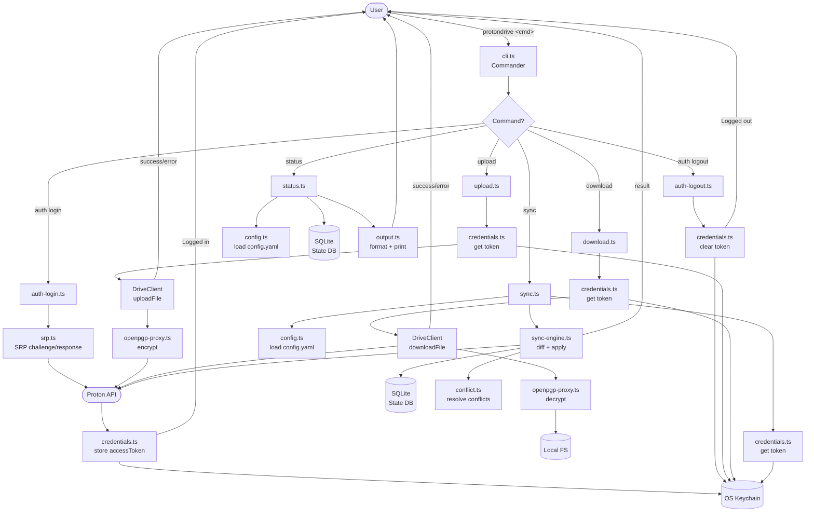
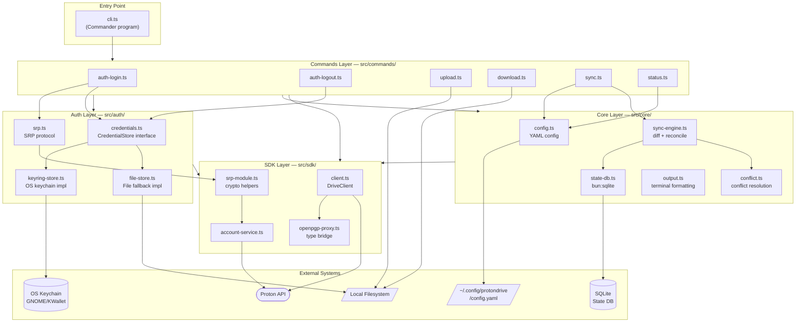
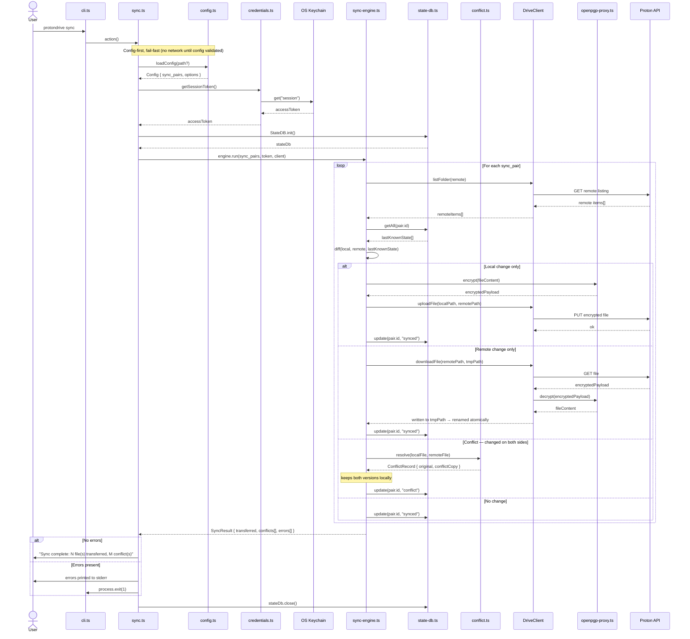

# ProtonDrive Linux Client — Diagrams

**Date:** 2026-04-05

---

## 1. Global Flow

Overall CLI execution lifecycle — from user invocation to exit.

---

## 2. High-Level Design (HLD)

Component architecture — four layers and external systems.

---

## 3. Sequence / Low-Level Design (SLD) — Sync Flow

Detailed component interaction for `protondrive sync` — the most complex operation.

---

_Generated using BMAD Method `bmad-agent-tech-writer` — MG capability_
