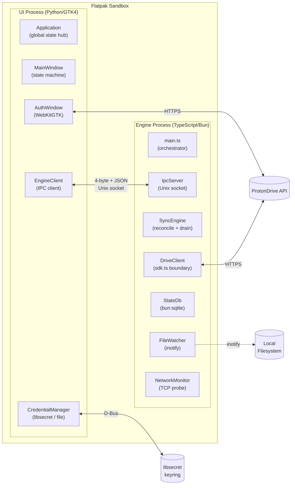
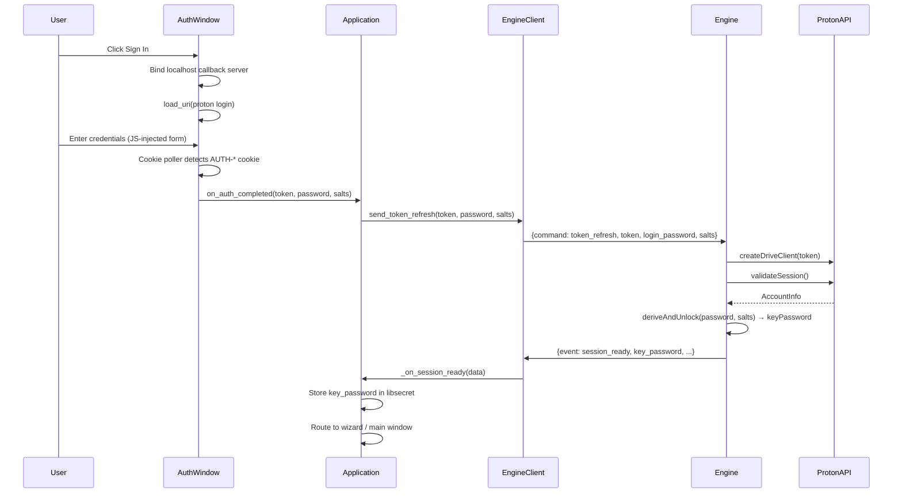
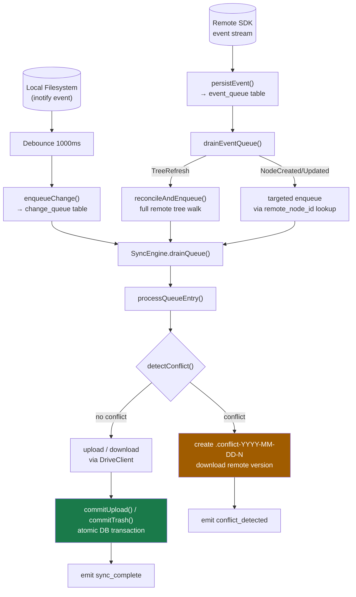
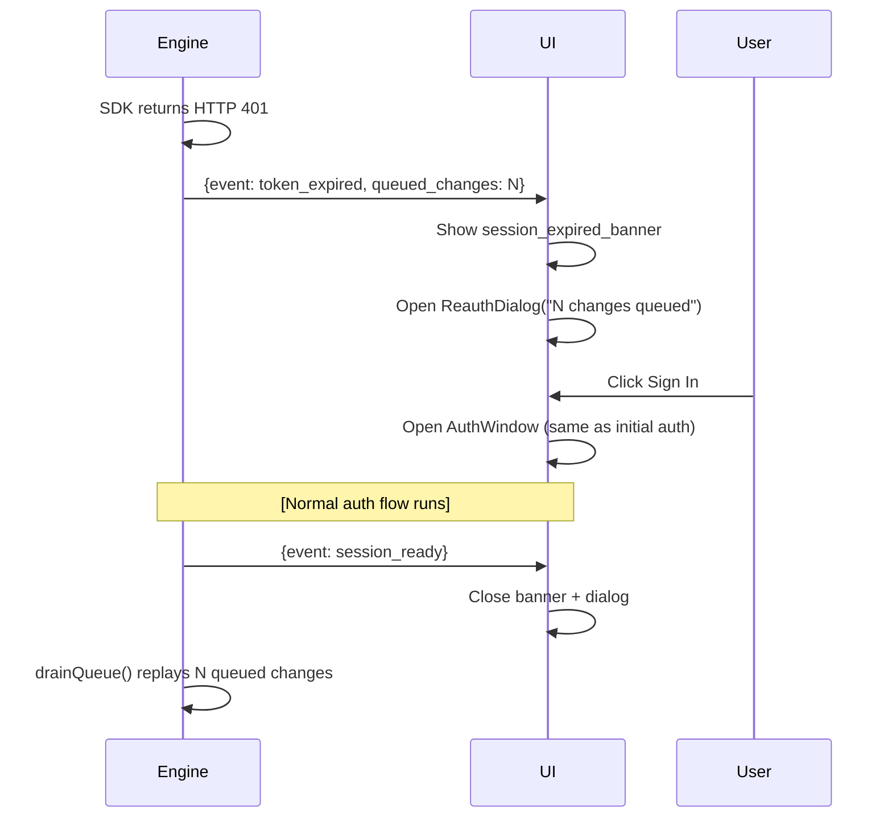
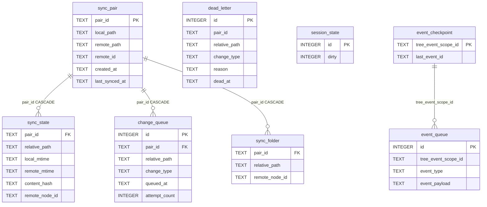
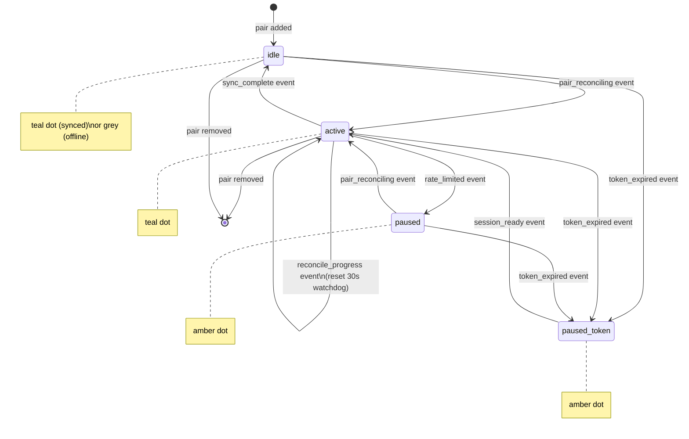
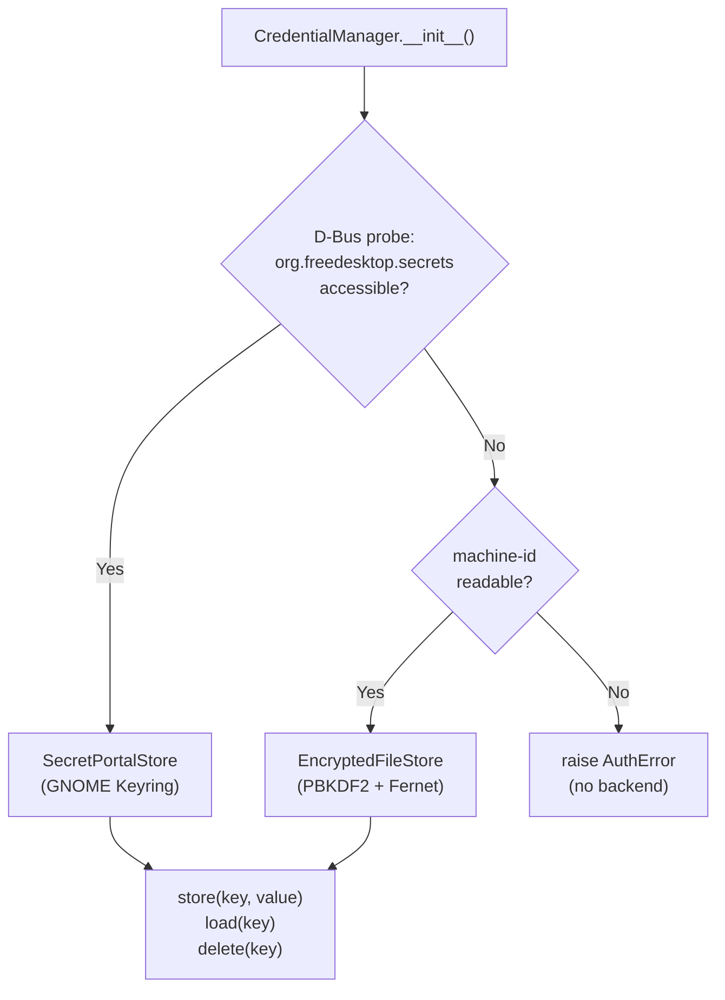

# ProtonDrive Linux Client — Diagrams

**Last Updated:** 2026-04-26

---

## 1. System Overview

Two cooperating processes inside the Flatpak sandbox.

```mermaid
graph LR
    subgraph Flatpak["Flatpak Sandbox"]
        subgraph UI["UI Process (Python/GTK4)"]
            App["Application\n(global state hub)"]
            Win["MainWindow\n(state machine)"]
            Auth["AuthWindow\n(WebKitGTK)"]
            Cred["CredentialManager\n(libsecret / file)"]
            Eng["EngineClient\n(IPC client)"]
        end

        subgraph Engine["Engine Process (TypeScript/Bun)"]
            Main["main.ts\n(orchestrator)"]
            IPC["IpcServer\n(Unix socket)"]
            Sync["SyncEngine\n(reconcile + drain)"]
            SDK["DriveClient\n(sdk.ts boundary)"]
            DB["StateDb\n(bun:sqlite)"]
            Watch["FileWatcher\n(inotify)"]
            Net["NetworkMonitor\n(TCP probe)"]
        end

        Eng <-->|"4-byte + JSON\nUnix socket"| IPC
    end

    Auth <-->|"HTTPS"| ProtonAPI[("ProtonDrive API")]
    SDK <-->|"HTTPS"| ProtonAPI
    Cred <-->|"D-Bus"| Keyring[("libsecret\nkeyring")]
    Watch -.->|"inotify"| FS[("Local\nFilesystem")]
```

---

## 2. Auth Flow

```mermaid
sequenceDiagram
    participant User
    participant AuthWindow
    participant Application
    participant EngineClient
    participant Engine
    participant ProtonAPI

    User->>AuthWindow: Click Sign In
    AuthWindow->>AuthWindow: Bind localhost callback server
    AuthWindow->>AuthWindow: load_uri(proton login)
    User->>AuthWindow: Enter credentials (JS-injected form)
    AuthWindow->>AuthWindow: Cookie poller detects AUTH-* cookie
    AuthWindow->>Application: on_auth_completed(token, password, salts)
    Application->>EngineClient: send_token_refresh(token, password, salts)
    EngineClient->>Engine: {command: token_refresh, token, login_password, salts}
    Engine->>ProtonAPI: createDriveClient(token)
    Engine->>ProtonAPI: validateSession()
    ProtonAPI-->>Engine: AccountInfo
    Engine->>Engine: deriveAndUnlock(password, salts) → keyPassword
    Engine->>EngineClient: {event: session_ready, key_password, ...}
    EngineClient->>Application: _on_session_ready(data)
    Application->>Application: Store key_password in libsecret
    Application->>Application: Route to wizard / main window
```

---

## 3. Sync Flow

```mermaid
flowchart TD
    FS[("Local Filesystem\n(inotify event)")] --> Debounce["Debounce 1000ms"]
    Debounce --> Enqueue["enqueueChange()\n→ change_queue table"]

    RemoteEvent[("Remote SDK\nevent stream")] --> EventBuf["persistEvent()\n→ event_queue table"]

    Enqueue --> Drain["SyncEngine.drainQueue()"]
    EventBuf --> DrainEv["drainEventQueue()"]

    DrainEv --> |TreeRefresh| Reconcile["reconcileAndEnqueue()\nfull remote tree walk"]
    DrainEv --> |NodeCreated/Updated| Target["targeted enqueue\nvia remote_node_id lookup"]
    Reconcile --> Drain
    Target --> Drain

    Drain --> Entry["processQueueEntry()"]
    Entry --> Conflict{"detectConflict()"}
    Conflict --> |"no conflict"| UpDown["upload / download\nvia DriveClient"]
    Conflict --> |"conflict"| Copy["create .conflict-YYYY-MM-DD-N\ndownload remote version"]
    UpDown --> Commit["commitUpload() / commitTrash()\natomic DB transaction"]
    Copy --> Emit["emit conflict_detected"]
    Commit --> Done["emit sync_complete"]

    style Commit fill:#1a7a4a,color:#fff
    style Copy fill:#a05c00,color:#fff
```

---

## 4. Token Re-auth Flow

```mermaid
sequenceDiagram
    participant Engine
    participant UI
    participant User

    Engine->>Engine: SDK returns HTTP 401
    Engine->>UI: {event: token_expired, queued_changes: N}
    UI->>UI: Show session_expired_banner
    UI->>UI: Open ReauthDialog("N changes queued")
    User->>UI: Click Sign In
    UI->>UI: Open AuthWindow (same as initial auth)
    Note over UI,Engine: [Normal auth flow runs]
    Engine->>UI: {event: session_ready}
    UI->>UI: Close banner + dialog
    Engine->>Engine: drainQueue() replays N queued changes
```

---

## 5. State Database Relationships

```mermaid
erDiagram
    sync_pair {
        TEXT pair_id PK
        TEXT local_path
        TEXT remote_path
        TEXT remote_id
        TEXT created_at
        TEXT last_synced_at
    }
    sync_state {
        TEXT pair_id FK
        TEXT relative_path
        TEXT local_mtime
        TEXT remote_mtime
        TEXT content_hash
        TEXT remote_node_id
    }
    change_queue {
        INTEGER id PK
        TEXT pair_id FK
        TEXT relative_path
        TEXT change_type
        TEXT queued_at
        INTEGER attempt_count
    }
    dead_letter {
        INTEGER id PK
        TEXT pair_id
        TEXT relative_path
        TEXT change_type
        TEXT reason
        TEXT dead_at
    }
    session_state {
        INTEGER id PK
        INTEGER dirty
    }
    event_checkpoint {
        TEXT tree_event_scope_id PK
        TEXT last_event_id
    }
    event_queue {
        INTEGER id PK
        TEXT tree_event_scope_id
        TEXT event_type
        TEXT event_payload
    }
    sync_folder {
        TEXT pair_id FK
        TEXT relative_path
        TEXT remote_node_id
    }

    sync_pair ||--o{ sync_state : "pair_id CASCADE"
    sync_pair ||--o{ change_queue : "pair_id CASCADE"
    sync_pair ||--o{ sync_folder : "pair_id CASCADE"
    event_checkpoint ||--o{ event_queue : "tree_event_scope_id"
```

---

## 6. Phase State Machine (per Sync Pair)

```mermaid
stateDiagram-v2
    [*] --> idle : pair added

    idle --> active : pair_reconciling event
    active --> active : reconcile_progress event\n(reset 30s watchdog)
    active --> idle : sync_complete event
    active --> paused : rate_limited event
    paused --> active : pair_reconciling event

    idle --> paused_token : token_expired event
    active --> paused_token : token_expired event
    paused --> paused_token : token_expired event
    paused_token --> active : session_ready event

    active --> [*] : pair removed
    idle --> [*] : pair removed

    note right of active : teal dot
    note right of paused : amber dot
    note right of paused_token : amber dot
    note right of idle : teal dot (synced)\nor grey (offline)
```

---

## 7. Credential Store Backend Selection

```mermaid
flowchart TD
    Init["CredentialManager.__init__()"] --> Probe{"D-Bus probe:\norg.freedesktop.secrets\naccessible?"}
    Probe -->|Yes| Secret["SecretPortalStore\n(GNOME Keyring)"]
    Probe -->|No| MachineId{"machine-id\nreadable?"}
    MachineId -->|Yes| Encrypted["EncryptedFileStore\n(PBKDF2 + Fernet)"]
    MachineId -->|No| Fail["raise AuthError\n(no backend)"]

    Secret --> Store["store(key, value)\nload(key)\ndelete(key)"]
    Encrypted --> Store
```
